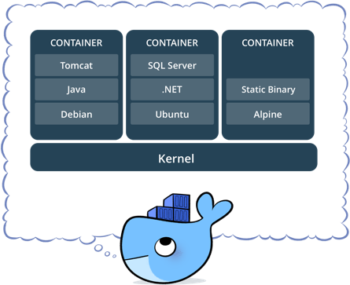

# 새롭게 알게된 점

## 도커를 사용하는 이유? 

- 컴퓨터 리소스의 효율적인 사용

> 물리적 하드웨어인 컴퓨팅 리소스를 가상화 기술을 활용하여 최대한 활용하기 위해
> (사실 도커 뿐아니라 가상머신도 해당되는 이유)

- 비지니스 목적에 유연한 아키텍쳐 지원

> 도커를 이용하면 다양한 프로그램, 운영체제 실행환경을 컨테이너(유닛)로 추상화하여 어떠한 환경에도 구애받지 않고 언제 어디서나 안정적으로 구동할 수 있다는 점이 가장 큰 장점

애플리케이션을 구동하기 위한 모든 과정을 간단하게 만들기 위함!

1. 개발환경과 프로덕션 환경의 재현성을 보장할 수 있음
2. 동일한 개발환경을 팀원들과 공유할 수 있음. 

가지고 있는 서버, 패키지 버전, OS에 따라 프로그램을 설치하는 과정에서 많은 에러들이 발생하는데 
이러한 단점을 도커를 사용하여 극복할 수 있다. 

## 가상화 기술이란?

물리적 하드웨어 시스템에서 여러 시뮬레이션 환경이나, 전용 리소스를 생성해주는 기술

### 가상화와 가상 머신

> 가상화는 쉽게 설명하면 **물리적** 개념을 **논리적** 개념으로 변환하여 구현한 것.

- 하나의 물리머신에서 복수의 시스템을 동시 운영한다는 뜻
- 또 다른 cpu, 메모리, 하드디스크, NIC 등을 논리적으로 생성한다는 뜻,
- 물리서버 단위가 아닌 애플리케이션 단위로 전환한다는 뜻

**가상화 이전**에는 서비스를 운영하기 위한 Application들이 OS 단위에 올라가 있고, OS들은 CPU, memory, 디스크 같은 하드웨어 위에 있는 환경으로 구성되어 있다. 따라서 하나의 서버 - 하나의 Application(1:1) 형태로만 운영이 가능했다.

- 안정적이지만, 비효율적이다.

**가상화 이후**에는 서비스를 운영하기 위한 Application들이 가상 머신위에 올라간다(1:N). 그리고 각각의 가상 머신들에는 서로다른 OS를 운영할 수 있고, 해당 OS에서 서로 다른 Application을 운영할 수 있는 환경이 만들어졌다.

#### - 어떻게 다른 OS를 사용하나?

각 OS 마다 ‘커널’이 존재한다. 커널은 리소스를 관리하고 명령어를 해석하는 역할, 하지만 각 OS마다 명령어를 해석하는 규칙이 다르다.

예를들어 CPU 하드웨어가 덧셈연산을 한다고 하면,

- 윈도우는 ‘Add’
- 레드햇은 ‘ADD’
- 맥은 ‘add’

하고 명령어를 가진다고 예를 들 때, 게스트 OS마다 말하는 명령어가 다르기 때문에 이를 통합적으로 이해하기가 불가능한다.

그래서 이러한 각각의 서로 다른 OS의 명령어를 이해하고 번역하여 처리해주는 역할을 하는 것이 **하이퍼바이저**이다. 이를 하이퍼바이저 기반의 가상화라고 한다.

#### - 가상화 주요 용어

가상화 환경에서 흔히 사용하는 대표적인 용어는 다음과 같다.

- **호스트 시스템(또는 물리적인 시스템 또는 서버):**

  호스트 시스템을 호칭하는 용어는 딱히 정해져 있지 않다. 서버 시스템, 물리적인 서버, 또는 물리적인 시스템 등으로 부르기도 하는데, 여하튼 CPU, 메모리, 하드 디스크, NIC, HBA 등 하드웨어 리소스를 장착한 물리적인 시스템 자체를 우리는 호스트 시스템이라 호칭하기도 하고, 또는 서버 시스템이라고도 한다. 가상화 운영체제 환경에서 호스트 시스템이라고 한다면 이렇게 물리적인 하드웨어 구성요소가 장착된 시스템을 총칭한다.

- **가상화 운영체제(또는 하이퍼바이저):**

  호스트 시스템 위에 설치되어 작동되는 가상화 운영체제를 하이퍼바이저라고 부른다. 이러한 하이퍼바이저는 물리적인 호스트 시스템 위에 설치되어 일종의 운영체제처럼 작동되며, 가상머신들이 하드웨어 리소스를 공유하여 사용할 수 있게끔 스케줄링하는 책임을 맡게 된다. 가상머신 생성과 리소스 할당 및 관리 작업들이 모두 이러한 가상화 운영체제에 의해 조정된다. 하이퍼바이저는 2가지로 구분되는데, 운영 체제가 프로그램을 제어하듯이 하이퍼바이저가 해당 하드웨어에서 직접 실행되며 게스트 운영 체제는 하드웨어 위에서 2번째 수준으로 실행되는 Type-1과 하이퍼바이저는 일반 프로그램과 같이 호스트 운영 체제에서 실행되며 VM 내부에서 동작되는 게스트 운영 체제는 하드웨어에서 3번째 수준으로 실행되는 Type-2가 있다.

- **가상머신(Virtual Machine 또는 줄여서 VM):**

  가상머신은 가상화 운영체제에 의해 생성된 가상의 하드웨어 집합체이다. BIOS와 CPU, 메모리, HDD, 네트워크 인터페이스 카드 등을 가지고 있다. 가상 머신 위에 설치되는 운영체제 입장에서는 실제의 물리적인 일반 시스템과 전혀 다를 바가 없으나, 실제로 이러한 가상 하드웨어들은 전부 일종의 파일 형태로 존재하거나 또는 해당 머신에서만 독점적으로 사용하는 것이 아니다.

- **게스트 운영체제(Guest Operating System 또는 줄여서 게스트 OS):**

  흔히 가상 머신과 게스트 운영체제를 혼용하여 사용한다. 엄밀히 말하면, 가상 머신 위에 설치되어 작동되는 운영체제들인 Windows, Linux 등을 게스트 운영체제라고 해야 한다.

출처 : http://www.virtual-space.co.kr/virtualization.html

### 하이퍼바이저란

위와 같은 가상화 기술을 구현하기 위해 기반이 되는 기술이다.

호스트에서 여러 가상 Guest OS를 실행하기 위한 플랫폼 개념으로 이해할 수 있다. 

> *VM과 하드웨어 간의 IO 명령을 처리하기 위한 인터페이스*

그래서 각종 App을 실행하기 위한 컴퓨팅 가상환경(VM) 동작할 수 있도록 해주는 역할을 한다.

## 도커란?

> 컨테이너 개념을 사용하여 응용프로그램을 더 쉽게 만들고 배포하고 실행할 수 있도록 설계된 도구!
컨테이너 기반의 오픈소스 가상화 플랫폼이며 생태계

**컨테이너** 안에 다양한 규격화된 물건들을 넣어 옮기듯이 마찬가지로 컨테이너를 사용하면 다양한 프로그램, 실행환경을 컨테이너로 추상화하고 동일한 인터페이스를 제공하여 프로그램의 배포 및 관리를 단순하게 해줌

이전에도 컨테이너 기술을 활용한 도구들은 많았으나, 마치 마이크로소프트의 윈도우 운영체제가 GUI와 함께 사용자 친화적인 높은 접근성으로 시장에서 점유율을 높인 것처럼 도커도 비슷하게 볼 수 있다.(물론 윈도우가 점유한던 다른 요소들도 존재한다) 윈도우 이전에도 운영체제는 존재 했지만, 일반 사용자가 사용하기에 적합한 접근성과 기능을 기대하긴 어려웠다. 

### 컨테이너

컨테이너는 코드와 모든 종속성을 패키지화하여 응용프로그램이 한 컴퓨팅 환경에서 다른 컴퓨팅 환경으로 빠르고 안정적으로 실행되도록 하는 소프트웨어의 표준 단위

### 이미지

이러한 컨테이너를 만들기 위해서는 도커 이미지가 필요한데 도커 이미지란 코드, 런타임, 시스템 도구, 시스템 라이브러리 및 설정과 같은 **응용프로그램을 실행시키는데 필요한 모든 것을 포함하는** 가볍고 독립적이며 실행가능한 **소프트웨어 패키지** 를 의미한다.

마치 파이썬에서 클래스(도커 이미지)를 작성하면 클래스(도커 이미지)로 생성되는 각각의 인스턴스들이 도커 컨테이너가 되는 셈이다.

## 가상머신과 도커 컨테이너와의 차이점

하이퍼바이저 기반의 가상화기술 VM에서 도커 컨테이너로 트렌드가 옮겨가는 이유는 무엇일까 ?

- 성능과 리소스 효율성 이슈(속도, 리소스 등)
- 애플리케이션 관리 프로세스의 편의성 (배포, 운영 등)

기존의 하이퍼바이저 기반의 가상화기술 VM과 도커의 컨테이너 방식을 비교했을 때, 컨테이너는 하이퍼바이저의 게스트 OS가 필요하지 않으므로 더 가볍다(오버헤드가 더 적다).

VM은 애플리케이션을 실행하기 위해서 VM을 띄우고 자원을 할당한 다음, 게스트 OS를 부팅하여 어플리케이션을 실행해야 해서 훨씬 무겁고 복잡하게 실행해야 함. -> 이때 중요한 것은 가상화한 게스트 OS모두 호스트 OS 입장에서는 다 프로세스로 동작하기 때문에 컴퓨팅 자원을 더 잡아먹음.

대신 도커 컨테이너 환경에서는 도커 엔진이 GuestOS와 Hypervisor 역활을 맡아 Host OS의 리소스 사용을 도와준다. 
애플리케이션을 실행할 때, 컨테이너 방식에서는 호스트 OS위에 도커 이미지(애플리케이션의 실행 패키지)를 배포하기만 하면 됨.

이둘의 **공통점**은

- 기본적으로 하드웨어에서 격리된 환경 내에 애플리케이션을 배치한다는 점이 동일하다.

**차이점**은

- 격리된 환경을 어느 수준까지 격리시키는지에 큰 차이점이 있다.

### 도커 컨테이너

- 동일한 HostOS를 사용하므로 각 컨테이너마다 **동일한 커널**을 공유한다. (컨테이너가 제공하는 격리 기능 내부에 샌드박스가 있지만,)
- 결과적으로 컨테이너 내부에서 실행되는 프로세스는 Host OS에서 확인이 가능함. (모든 프로세스를 나열할 수 있는 충분한 권한이 Host OS에 있음)
- 예를 들어, 도커와 몽고 DB 컨테이너를 실행하면, Host OS의 쉘에서 `ps -e grep mongo` 로 실행중인 몽고컨테이너 프로세스 확인 가능함.
- 컨테이너는 전체 OS를 내장할 필요가 없어서, 가볍고 일반적으로 5-100MB 크기를 가짐.
- 컨테이너를 띄우는데 까지 걸리는 시간이 매우 빠르다.
- 호스트 OS에 문제가 생기면 모든 컨테이너에 영향을 미친다.

### 가상 머신(VM)

- VM와 내부에서 실행되는 모든 프로세스는 Host OS또는 Hypervisor와 독립되어 있음.
- 가상 머신 플랫폼은 특정 VM(VM1)에 대한 가상화 프로세스를 관리하는 프로세스를 시작, Host OS는 그 하드웨어 자원을 일부 VM에 할당
- 컨테이너와 다른 것은 VM 환경을 위해, 해당 VM만을 위한 커널을 부팅, 운영체제 프로세스 세트를 시작한다는 점
- 일반적으로 응용 프로그램만을 포함하는 일반적 컨테이너보다 VM의 크기가 훨씬 크다. (GB단위)
- 애플리케이션을 띄우기까지 과정이 오래걸리고 복잡하다. 
- OS까지 가상화 (맥에서 윈도우, 리눅스에서 윈도우를 돌리는)
- 추가적으로 필요한 기능을 위해 VM 머신 벤더들에게 라이센스 비용을 지불해야 하기도 한다.
- VM간에 완벽하게 격리되어 안정성이 높음
- 사용법은 간단하지만 굉장히 느림
  - VM과 도커의 성능비교 아티클 : https://artistdata.tistory.com/5

#### 참고자료

[[클라우드 흐름 1\] 가상화와 하이퍼바이저 개념정리](https://pearlluck.tistory.com/121)

[[virtualization\] 하이퍼바이저, 전가상화, 반가상화](https://itholic.github.io/hypervisor/)

[Docker란 무엇입니까? | AWS](https://aws.amazon.com/ko/docker/)

[도커(Docker)의 개요 및 장점 그리고 도커를 쓰는 이유](https://hanhyx.tistory.com/27)

# 함께 이야기하고 싶은 점

- VM 기반의 VMware 사용 경험
- 도커 사용을 지양 혹은 적용하기 어려운 분야가 있을까? (항상 도커가 짱일까?)
