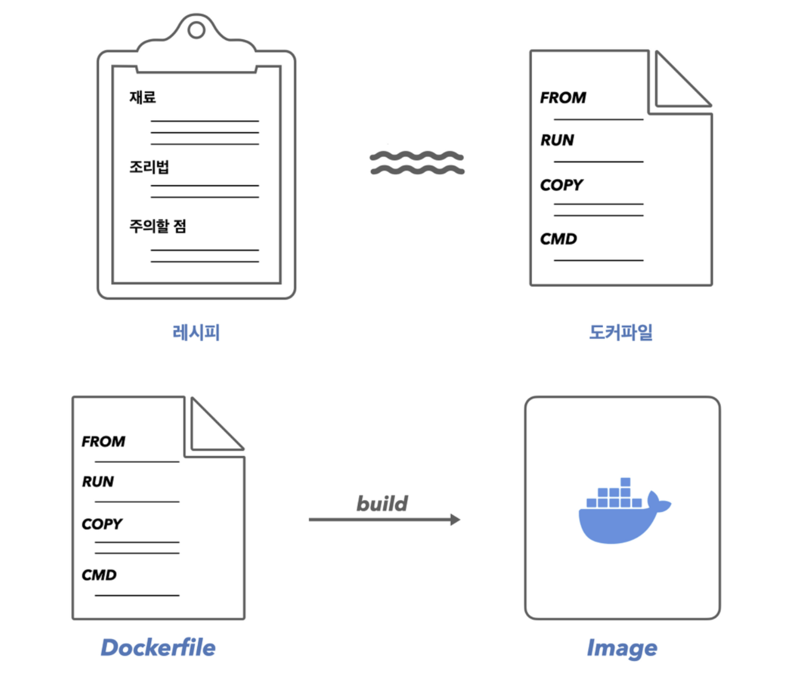
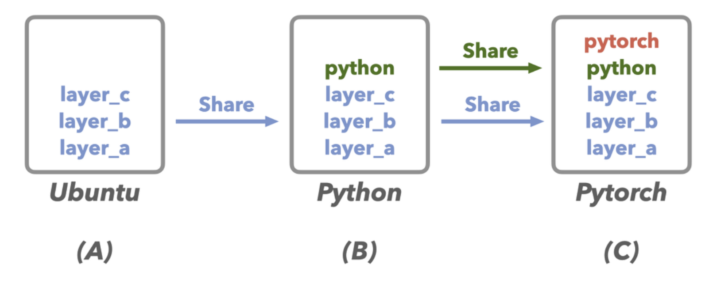

# Image & Container

### Image와 Container

---
<p float="center">

</p>

- Image
    - 애플리케이션을 실행시키기 위한 모든 코드와 환경에 대한 정보가 명시되어 있음
    - 컨테이너를 실행하기 위한 템플릿 같은 개념
- Container
    - 이미지를 실행시킨, 작동하는 인스턴스

### DockerFile

---

→ 나만의 이미지를 빌드 하기 위해, Dockerfile을 작성할 수 있다.

→ 이미지가 어떠한 구성을 가질지 명시해 주는 파일이다.

→ 요리로 예를 들어보면, 요리(Image)를 완성하기 위한 모든 방법이 명시되어 있는 레시피(DockerFile)라 볼 수 있다.

<p float="center">

</p>


`FROM`

- 애플리케이션을 위한 Base 이미지
- Docker Hub이나 로컬에 존재하는 특정 이미지를 명시하면, 이를 기반으로 이미지가 구성된다.

`WORKDIR`

- WORKDIR의 위치를 기반으로, 아래의 Dockerfile의 모든 명령문들이 실행된다.

`COPY` <로컬의 위치> <이미지 내의 위치>

- <로컬의 위치>에 있는 코드와 파일들을 <이미지 내의 위치>에 가져옴(복사함)

`RUN`

- 이미지 생성(빌드)시 필요한 명령문을 작성
- 컨테이너 실행시 필요한 명령문이 아님을 주의! (이미지 생성과 컨테이너 생성을 헷갈리지 말자.)

`EXPOSE` <port>

- EXPOSE를 명시 했더라도, docker run 명령시 port를 따로 연결 해줘야만 한다.
- EXPOSE는 단지 dockerfile의 문서화를 위한 기능이지, port연결 시 아무런 효력이 없다.

`CMD` [”a”, “b”]

- 컨테이너를 실행할 때, 적용될 명령어

### Image Layer

---

- Docker는 이미지를 ***layer***라는 단위로 구성해놓고, 해당 레이어를 다른 이미지들끼리 공유할 수 있도록 설계해 놓았다.
- 덕분에, Dockerfile을 수정하더라도, 수정되지 않은 것에 대해서는 이전에 만들어진 레이어를 사용한다. 이는 이미지 빌드 속도와 이미지 용량을 효율적으로 관리할 수 있다.

<p float="center">

</p>
    
    
- 이때, 해당 Layer가 이전에 만들어진 Layer와 동일한지 아는 방법은, 도커가 레이어들의 결과물들을 캐싱하고 있기 때문이다.
- 하지만, Dockerfile의 구성에서 한번 새로 보이는 것이 있으면, 그 아래에 있는 명령어도 다 새로운 것이라 보고 레이어를 새롭게 만든다. 즉, 변경 레이어에 대해 모든 후속 레이어들은 다시 새롭게 빌드가 된다.
- 때문에, 자주 변경될 요소가 있는 Dockerfile의 명령문을, 그렇지 않은 명령문 보다 뒤에 배치해 두는 것이 효율적이다.

### Command

```bash
docker run <image>
# 이미지를 실행시켜, 컨테이너를 생성
# 만약 이미지가 없다면, docker hub에서 찾아서 최신버전을 다운로드 받음
# 버전 명시가 없으면, 기본적으로 latest 버전으로 인식
# -d : detached 모드(컨테이너 내의 터미널에서 빠져나옴. 컨테이너는 백그라운드 실행)
# -i : 사용자가 입출력 할 수 있는 상태(interactive)
# -t : 가상 터미널 환경 활성화(tty)
# -p : public -> 포트 연결을 위해 사용
# --rm : 실행된 컨테이너가 중지될 때, 곧바로 삭제까지 진행됨
# --name : 컨테이너에 원하는 name 태그를 달 수 있음

docker ps -a
# ps -> process
# 모든 컨테이너, 프로세스를 보여준다.
# -a를 붙이지 않으면, 현재 실행중인 컨테이너만을 보여준다.
# -a를 붙이면 중단된, 과거의, 실행중인 모든 컨테이너를 보여준다.

docker stop <container>
# 실행중인 컨테이너를 stop 한다.

docker start <container>
# 중지된 컨테이너를 start 한다.
# 실행 하면 run과는 달리, detach모드로 빠져나옴
# -a : attached 모드로 start할 수 있음
# -i : interactive 하게 입력할 수 있음

docker attach <container>
# 실행중인 컨테이너 내부에 들어가게 됨

docker logs <container>
# 컨테이너의 로그들을 볼 수 있다

docker rm <container>
# 사용하지 않는 컨테이너를 삭제할 수 있다.
# 실행중인 컨테이너는 삭제할 수 없으며, stop을 하고 삭제를 해야한다.

docker cp <복사 하려는것> <컨테이너>:<특정 폴터/파일 위치>
# 폴더/파일들을 실행 중인 컨테이너에 복사할 수 있고
# 실행중인 컨테이너의 특정 폴더/파일을 복사해 추출할 수 있다.
# -> 특정 코드파일의 코드가 변경 되었을 때, 이를 다시 이미지로 새롭게 빌드하는게 아니라, 
# 이런식으로 추가해서 변경할 수 있다.
# 하지만 각종 에러를 발생시킬 수 있기에, 권장되는 방법은 아니다.
# 컨테이너에서 찍히는 로그 파일들을 로컬로 가져와서 분석할 수 있다.

docker build <dockerfile이 있는 위치>
# dockerfile을 image로 빌드
# -t(--tag) : name:tag -> 이미지에 원하는 name 태그를 달 수 있다.
# 이미지는 name과 tag 이렇게 2가지로 구성되어 있음 -> name:tag

docker images 
# image를 리스팅

docker rmi <image>
# image를 삭제
# 해당 이미지로 실행된 컨테이너가 있을 시, 삭제 불가
# 컨테이너가 실행된다는것은, 이미지 위에 실행에 대한 레이어가 부가 되는것

docker image prune
# 사용되지 않는 모든 이미지 제거

docker image inspect <image id>
# 이미지에 대한 정보 출력
# 이미지를 구성하고 있는 레이어를 살펴볼 수 있다.
```

### Docker Image 공유 방법

---

1. `DockerFile`을 공유
    - 빌드 된 Docker Image를 공유하는 것보다, 훨씬 경량화되어 있고 빠르다.
    - 하지만, 결국 사용자가 다시 이미지로 빌드 해야 하기에, 후속 작업이 더 필요하다.
2. `Docker Image`를 공유
    - 빌드 된 Docker Image를 DockerHub과 같은 플랫폼을 활용하여 공유
    - 새롭게 빌드 할 필요할 없이, 바로 컨테이너로 실행시킬 수 있다.

# 새롭게 알게되어 좋았던 사실들

- `docker cp`
    - 최근 특정 프로젝트에서 Docker Image를 빌드 하여 AWS에 업로드를 해야 하는데, 작은 코드의 실수들 때문에(정말 한 줄 정도의 사소한..), 이미지를 여러 번 빌드 하게 되었고, 시간이 엄청 오래 걸렸다. 그런데, docker cp를 활용했다면, 간단하게 그 코드만 수정을 할 수 있었고 시간도 많이 절약했을 것이다.
    - 하지만, 코드 변경을 위해서 docker cp를 활용하는 걸 그리 추천을 하진 않는다고 한다. 그 이유는 해당 코드 변경으로 인한 오류들이 많이 발생할 가능성이 높고, 관리하기 어렵기 때문이다.
    - 이러한 코드 변경을 위해 더 좋은 방법을 알려준다고 했는데, 아직 배우지 못했다. 어떤 방법일까?
- DockerFile 작성 시 순서 중요!
    - 위와 같은 맥락으로, 빌드의 시간을 엄청 단축시킬 수 있었을 것이다. 자주 변경될 코드 파일을 가장 마지막에 `COPY` 했다면, 해당 변경 사항만 레이어로 생성되어 이미지를 얻을 수 있었을 것이며, 시간이 엄청 빨랐을 것.
