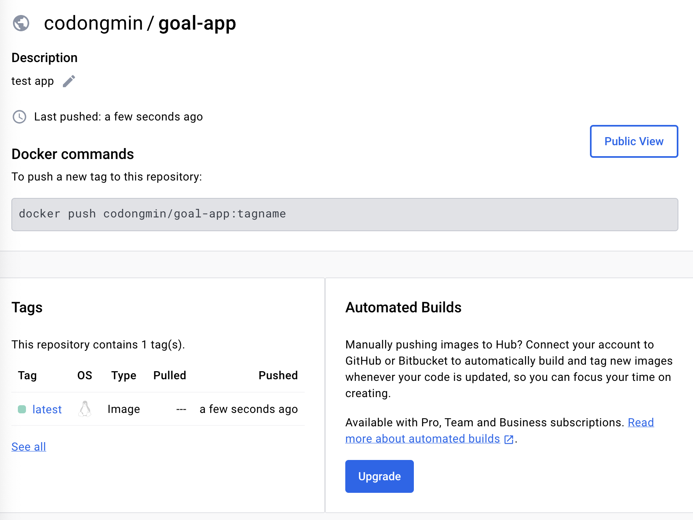

# 새롭게 알게된 점

- 도커 이미지와 컨테이너(코어 빌딩 블록) 핵심 컨셉
- 미리 작성된 & 커스텀 이미지의 사용 방법 
- 이미지와 컨테이너 관리하는 방법


## 1. 도커 이미지와 컨테이너(코어 빌딩 블록) 핵심 컨셉

컨테이너에는 실행가능한 소프트웨어 유닛.  
이미지는 컨테이너의 템플릿, 블루프린트를 의미함.  
실제 코드와 코드를 실행하기 위한 런타임 환경이 들어 있음.  

하나의 (셋업된)이미지로 여러 컨테이너들을 빌드할 수 있음.  
= 다른 시스템과 다른 서버에서 여러번 실행할 수 있다는 뜻.   

이미지는 하나의 공유 가능(Sharable)한 추상적(abstract) 패키지.  
컨테이너는 이미지의 구체적인(concrete)한 실행 인스턴스.   

> 도커의 핵심 기본 개념 : 이미지를 기반으로 -> 컨테이너를 실행 


## 2. 이미 존재하는 & 커스텀 이미지의 사용 방법 

컨테이너를 실행하려면 이미지가 필요한데 이미지는 사용하기 위해 얻기에는 다음과 같은 방법들이 있다. 

1. 이미 존재하는 이미지를 사용
    - 팀에서 구축하였거나, 
    - 공식 이미지를 사용 (python, node, ubuntu 등)
    - Docker Hub 사용(이미지 호스팅)

```bash
docker run node
// 1. local에 이미지가 없으면
// 2. docker hub에서 pulling 
```

주의사항 : `docker run` 커맨드는 항상 최신버전을 실행하지 않는다. 만약 로컬에 해당 이미지가 없을 경우에는 허브에서 최신 버전을 pulling 하지만, 만약 이전 버전이라도 이미지가 로컬에 존재한다면, 로컬에 있는 이미지를 실행시킨다. 따라서 최신 버전이 필요한 경우 직접 pull 명령어를 통해 최신 이미지를 가져와야 한다.


컨테이너는 격리된 환경에서 실행되기 때문에 shell에서 직접적으로 사용자에게 노출되진 않음. 
대신, 특정 명령어로 도커 컨테니어너 내부에서 호스팅 머신(사용자가 활동중인)으로 대화형 세션을 노출 시킬 수 있음

```bash
docker run -it node
```


2. 커스텀 이미지 사용
    - 필요한 이미지를 직접 구축, 
    - 기존에 존재하는 이미지와 합쳐서 사용 가능 
    - 도커 파일 작성하여 커스텀 이미지 구축 가능


도커파일 작성 예시는 다음과 같음.

```docker
# 이미지를 빌드할때 실행하려는 도커에 대한 명령
# 이미지 빌드에 대한 Setup/Configuration Instruction

FROM node
# -> Base Image (like OS, other tools)

WORKDIR /app
# -> default 도커 컨테이너 및 이미지의 작업 디렉토리에서 실행
# -> 작업 디렉토리 == 컨테이너 fileSystem의 / 루트 폴더
# -> 이후 모든 후속 명령어가 설정한 디렉토리 내부에서 실행되야 한다고 지정

COPY . /app
# -> Tell docker which file's should go into the Image. 
# -> COPY 'HostFileSystem' 'Image/ContainerFileSystem'(WORKDIR)
# -> 모든 이미지와 (이미지 기반 생성된)컨테이너에는 로컬 머신의 file system에서 완전히 분리된 자체 내부 file system이 존재

RUN npm install
# -> default 도커 컨테이너 및 이미지의 작업 디렉토리에서 실행
# -> 작업 디렉토리 == 컨테이너 fileSystem의 / 루트 폴더

EXPOSE 80
# 도커의 격리된 실행환경으로 자체적인 내부 네트워크가 존재함.
# 컨테이너 내부의 애플리케이션에서 포트 80을 수신할때, 컨테이너는 로컬 환경에 포트를 드러내지 않음
# 따라서, 컨테이너 포트 : 로컬 포트와 연결해주어야 함. 
# 옵션이지만 명시적으로 드러내주는 편이 좋기도 함. 컨테이너 프로세스가 포트를 노출할 것임을 알리는 문서화의 일종

CMD [ "node", "server.js" ]
# RUN & CMD 차이 
# RUN --> Dockerfile로 부터 Image를 빌드하는 순간 실행
# CMD --> Image로부터 컨테이너를 생성하여 실행 시 최초에 수행
# CMD를 특정하지 않으면 베이스 이미지가 실행되며, 없을 경우 에러 발생
```

도커 파일을 작성한 후 해당 도커 파일을 이미지로 빌드하기 위해 다음과 같이 실행.

```bash
docker build .
```

이후에는 docker run 커맨드로 이미지를 실행시킬 수 있음.

```
docker run [image id]
```

> ID를 사용하는 도커의 커맨드는 항상 전체 ID를 복사할 필요는 없음. 예) 4615f988ae02
>
> 보통 커스텀 이름을 지정하기도 하지만, 앞자리의 고유 식별자가 존재한다면 자동적으로 해당 이미지로 실행시켜줌 
> (단, 중복이 없어야 함.) 예) docker run 461 도 가능 (461로 시작하는 다른 ID가 없다면)


## 3. 이미지와 컨테이너 관리하는 방법


### 이미지 

- 이미지 이름 **태그(명명)**
- 빌드한 이미지 **조회** 
- 이미지 **분석 & 검사**
- 이미지 **제거**


- 이미지를 조회하는 방법 

```
docker images 
docker image ls
```

- 이미지를 제거하는 경우

단, 이 경우에 제거하려는 이미지를 기반으로하여 (실행 상관 없음)생성된 컨테이너가 없어야 한다.

```
docker rmi [image ID or name]
```

- 사용되지 않는 모든 이미지의 제거 

```
docker image prune
```


- 이미지 검사 

실행되는 컨테이너는 명령 레이어가 이미지 위에 추가된 얇은 부가 레이어 

이미지 코드는 실행중인 컨테이너에 사용되고, 복사되지 않음  

```
docker image inspect [image ID or name]
```

```
[
    {
        "Id": "sha256:3d1fbc53121aadfd666e00e766677e7da014a1f90f301f49ccc827ca9c7ae979",
        "RepoTags": [],
        "RepoDigests": [],
        "Parent": "",
        "Comment": "buildkit.dockerfile.v0",
        "Created": "2023-12-26T09:52:19.384796066Z",
        "Container": "",
        "ContainerConfig": {
            "Hostname": "",
            "Domainname": "",
            "User": "",
            "AttachStdin": false,
            "AttachStdout": false,
            "AttachStderr": false,
            "Tty": false,
            "OpenStdin": false,
            "StdinOnce": false,
            "Env": null,
            "Cmd": null,
            "Image": "",
            "Volumes": null,
            "WorkingDir": "",
            "Entrypoint": null,
            "OnBuild": null,
            "Labels": null
        },
        "DockerVersion": "",
        "Author": "",
        "Config": {
            "Hostname": "",
            "Domainname": "",
            "User": "",
            "AttachStdin": false,
            "AttachStdout": false,
            "AttachStderr": false,
            "ExposedPorts": {
                "80/tcp": {}
            },
            "Tty": false,
            "OpenStdin": false,
            "StdinOnce": false,
            "Env": [
                "PATH=/usr/local/sbin:/usr/local/bin:/usr/sbin:/usr/bin:/sbin:/bin",
                "NODE_VERSION=20.5.1",
                "YARN_VERSION=1.22.19"
            ],
            "Cmd": [
                "node",
                "server.js"
            ],
            "ArgsEscaped": true,
            "Image": "",
            "Volumes": null,
            "WorkingDir": "/app",
            "Entrypoint": [
                "docker-entrypoint.sh"
            ],
            "OnBuild": null,
            "Labels": null
        },
        "Architecture": "amd64",
        "Os": "linux",
        "Size": 1102656041,
        "VirtualSize": 1102656041,
        "GraphDriver": {
            "Data": {
                "LowerDir": "/var/lib/docker/overlay2/b9w059whvoi000g1lux0ucre8/diff:/var/lib/docker/overlay2/gwex6669700quraehg08x4chb/diff:/var/lib/docker/overlay2/297bd3cff48c0d39c1d68a3cbb5479a3c826449103e7ffd91786579781118501/diff:/var/lib/docker/overlay2/4e1434a3112cf126ded24dfb0858e2e1981d87139cffd65689b3ccf914375409/diff:/var/lib/docker/overlay2/67f49744b04d389f824ec95738a20590e440798aaaa673aac1665404f96009fa/diff:/var/lib/docker/overlay2/5c44577b23dcdcae460238a6e2afa4d93e04208501c90497d0ae3f756d55fff8/diff:/var/lib/docker/overlay2/a896904e25d8266824ee920e11b8c182ee8050e38c0359939f34e69a2ffa9718/diff:/var/lib/docker/overlay2/2e335ab1b6be49cf31e3fc763248a1e40936c1631f209d188ac04f516e180da2/diff:/var/lib/docker/overlay2/9c77d4bcba5730ebdc617a576564f75d89dd94688cb8bfbd0f857faabe96da4c/diff:/var/lib/docker/overlay2/bb0707e7b24485b0984037bc8a07354d96b16814f963a283e2130a7d89ce1b70/diff",
                "MergedDir": "/var/lib/docker/overlay2/rszhcqkmeu8jhmi5kipfuihll/merged",
                "UpperDir": "/var/lib/docker/overlay2/rszhcqkmeu8jhmi5kipfuihll/diff",
                "WorkDir": "/var/lib/docker/overlay2/rszhcqkmeu8jhmi5kipfuihll/work"
            },
            "Name": "overlay2"
        },
        "RootFS": {
            "Type": "layers",
            "Layers": [
                "sha256:ff61a9b258e5be019eb30e2ea80b8cefaafb27360a154e5ec0e50f7b9a9cc068",
                "sha256:43ba18a5eaf87c0a4c4bf4ea6fc04d26774e8302bc20dd9b2a5e4023cb75c087",
                "sha256:6aa872026017a6174385a71ce57d72500b5acbac1e1ec168880d0028ce773ae9",
                "sha256:b485c6cd33a6678b17655f6ef5fbde009a366e207c04d59535daa61dd397bc6d",
                "sha256:59c677849659ca0bc0ee989823dbaa0d45dc91c15bc486dc342a1c0161a6a602",
                "sha256:7e98a34e8d5d70a422797373b38f1adc0d296bd0de81181771ddd1003b59a976",
                "sha256:488ed91819d9427ebd7b94c1356196fe682bb591ebf4ce23a284791d2fdabc5f",
                "sha256:cb591dd771d8de17785c9b2bc55e6eb2e29785247954a43f67294527976155e0",
                "sha256:d831a862e80e8ed34dd6ddb54208f5b6f0d827811929f63603fe9bd27f461a74",
                "sha256:909afab72b3ec7ad83e33a78537583ede4fce4115dd30f5782b2dd08417a5d0d",
                "sha256:446e445fc8fb01f56dddd056d480cdd7c0ef3d1d0186c4d5119c2e37aa5522d2"
            ]
        },
        "Metadata": {
            "LastTagTime": "0001-01-01T00:00:00Z"
        }
    }
]
```

ID, OS, Creted, Layers 까지 이미지에 대한 구성 정보를 확인할 수 있음.


- 이미지에 이름 붙이기 
  - 이미지 태그는 2부분으로 구성되는데 
  - Name(repository) : tag
  - name은 **이미지의 그룹**을 표현할때 사용하고, tag는 옵션으로 **특정 버전**을 지정할 수 있음.
  - ex) node:14
  - 배포 및 CI/CD 과정에서 주요한 기능으로 동작하지 않을까 짐작

>t, --tag stringArray               Name and optionally a tag (format:"name:tag")

```
docker build -t [name]:[tag] .
ex) docker build -t goals:latest .
```


- 이미지 공유 

  - 공유한 이미지를 통해 컨테이너를 실행함으로써 다른 환경에서도 동일 이미지 기반의 동일한 실행값을 보장할 수 있다. == 재현성이 높다.
  - 이미지를 공유하는 방법은 2가지 이다. 
    - Dockerfile + 소스코드 공유. -> 빌드 및 소스코드, 파일 구조 필요 
    - 이미지 파일을 공유 -> 빌드 단계 필요 없음. (주로 사용⭐️)

  

  - 도커 허브로 이미지를 **push**하는 방법은 다음과 같음 

    1. 도커 허브에 로그인

    2. 도커 허브에 레포지토리 생성 "codongmin/goal-app" (public)

    3. 도커 이미지의 이름과 레포지토리의 이름이 같아야 함. 

       1. 기존 도커의 태그를 변경하는 방법은 다음과 같음 
       2. `docker tag [old name]:[old tag] [new name]:[new tag]`

    4. `docker push [repository name]:[tag(optional)]`

       ``docker push codongmin/goal-app:latest` 

       

  - 도커 허브에서 이미지를 **pull**하는 방법은 다음과 같음 

    1. 로컬에서 ``docker pull codongmin/goal-app:latest` 


### 컨테이너

- 컨테이너 **이름 명명**
- 컨테이너 **세부 구성** 
- 컨테이너 **조회** 
- 컨테이너 **재시작**
- 컨테이너 **제거**


- 컨테이너를 조회하는 방법 

>-a, --all             Show all containers (default shows just running)

```
docker ps 
docker ps -a
```

기본적으로 실행중인 컨테이너를 조회하고 -a 옵션이 있을 경우 실행 + 중지된 컨테이너를 모두 조회한다.


- 이미 존재하는 컨테이너 시작하는 경우

```
docker start [container ID or name]
```

이 경우에는 컨테이너에 attached(번역이 뭔가 매끄럽지 않음..) 되지 않음(=컨테이너는 백그라운드로 실행됨) 로그 X, 콘솔 X

도커 run을 통한 명령의 경우 컨테이너를 새로 만들면서 attached 되지만, 로컬환경에서 컨테이너에 attach됨


>-d, --detach                         Run container in background and print container ID

```
docker run -d(detach mode option) [image] 
```

- default = attached mode
- attached 되다 = block 되다  = foreground 에서 실행된다. = 컨테이너와 상호 작용하도록 흐름


> -a, --attach               Attach STDOUT/STDERR and forward signals

```
docker start -a(attach mode option) [container]
```

- default = detached mode
- detached 되다 = non-block되다 = background 에서 실행된다. = 컨테이너와 상호작용하지 않도록 흐름


detach 된 실행중인 컨테이너에는 다음과 같은 명령어로 attach 할 수 있음

```
docker container attach [container ID or name]
docker attach [container ID or name]
```

detach 된 실행중인 컨테이너의 로그 메시지에 엑세스하는 방법

```
docker logs -f(follow, attach mode) [container ID or name]
```


- 컨테이너 <u>생성시</u>에 인터엑티브 모드로 들어가기

> -i, --interactive                    Keep STDIN open even if not attached
>
> -t, --tty                            Allocate a pseudo-TTY

STDIN 표준입력을 유지하고, 터미널을 할당하는 키워드를 결합하여 컨테이너에 입력을 추가하고, 컨테이너에 의해 노출되는 터미널도 획득 가능함.

```
docker run -it [image ID or name]
```


- 이미 생성된 컨테이너 <u>시작시</u>에 사용자의 입력이 필요한 경우

>-a, --attach               Attach STDOUT/STDERR and forward signals
>  -i, --interactive          Attach container's STDIN

Detach 모드로 실행되는 컨테이너의 경우 사용자의 입력을 받을 수 없어, 종료하고 attach 모드로 다시 실행하게 되면,
사용자 입력이 1번밖에 입력되지 않는 오류 발생

```
docker start [container ID or name]
docker stop 
docker start -a [container ID or name]
... 입력중지
```

다음과 같이 옵션값을 주어 실행하게 되면 터미널로 실행이 가능

```
docker start -a -i [container ID or name]
```


- 컨테이너 삭제 (정지된)

```
docker (container) rm [container ID or name]
```


- 중지된 컨테이너 자동 정지

> --rm                             Automatically remove the container when it exit

```
docker run -d --rm [image ID or name]
```


- Local -> 실행중인 컨테이너로 파일 복사 

```
docker cp [source path(local)] [container ID or name]:[destination path(container dir)]

ex) docker cp dummy/test.txt determined_cray:/app 
```

주로 사용하는 예제들이 적합한 경우가 많이 없음 

옛날에 주피터 노트북을 도커로 올릴때 데이터 복사 했던 적이 있었음. 

- 실행중인 컨테이너 -> Local로 파일 복사

```
ex) docker cp [container ID or name]:[source path(container dir)] [destination path(local)] 

ex) docker cp determined_cray:/app/test.txt dummy 
```

컨테이너에서 생성하는 로그파일을 긁어올때 사용하기도 함.


- 컨테이너의 이름 설정하기 

> --name string                    Assign a name to the container

```
docker run --name [name] [container ID or name]
```


---


## 명령어 모음 
- 도커 이미지의 인스턴스 생성(컨테이너)
```
docker run [image]
// 1. local에 이미지가 없으면
// 2. docker hub에서 pulling 
```

- 모든(실행/중지) 도커 컨테이너 프로세스 확인 
```
docker ps -a
```

- 실행중인 도커 컨테이너 프로세스 확인 

```
docker ps
```

- 이미지 기반으로 컨테이너 생성 + 내부의 세션에 접근하고자 할때 

```docker
docker run -it [image]
```

- 도커파일을 기반으로 커스텀 이미지를 빌드할때
```bash
docker build [docker file path]
```

- 이미지 기반으로 컨테이너 생성 + 도커 내부 특정 포트에 엑세스 하여 실행하는 방법
```
 docker run -p [localhost port]:[container app port] [image ID]
```

- 중지된 컨테이너를 실행하는 명령
```
docker start [container ID or container name]
```


---


# 함께 이야기하고 싶은 점

## 도커 이미지의 작동 방식과 레이어 개념

**도커 이미지 작동방식**

- 도커파일로 생성된 이미지는 정확히 도커 파일에 작성된 커맨드 대로 동작을 하여 빌드 된다. 그렇게 빌드된 도커 이미지는 빌드된 당시의 소스코드(애플리케이션)을 기반으로 하여 빌드된다. 일종의 (소스코드 + 런타임 환경)**스냅샷**의 기능을 한다.

- 따라서 이미 생성된 도커 이미지의 파일 시스템은 새롭게 수정(write)가 불가능하고 **오직 읽기(read only)만 가능**하다.

- 만약 소스코드에 변경사항이 생겨 이를 반영해야 한다면, 기존에 빌드한 도커 이미지를 수정하는 것이 아닌, 새로운 도커 이미지를 생성해야한다.


**이미지 레이어**

도커 이미지는 기본적으로 레이어라는 개념을 가진다. 
레이어 개념을 도입함 으로써 얻는 이득은 빌드시간의 단축과 데이터 자원의 효율적 사용을 위함이다. 

>레이어란?
>
>**파일시스템의 변경사항을 캡쳐하는 단위**, 스냅샷의 단위 개념으로 이해
>
>위에서 도커 이미지를 일종의 스냅샷에 비유, 여러 개의 레이어들(스냅샷 단위)이 합쳐진 것이 이미지(스냅샷)

- 도커 이미지는 union file system의 기반으로 동작한다.
- 서로 다른 레이어는 다른 이미지에 재사용될 수 있다. 
- 수정가능한 컨테니어 레이어는 새로운 이미지 레이어가 될 수 있다.


**UnionFS란**

 하나의 디렉터리 지점에 여러 개의 디렉터리를 마운트함으로써, 마치 하나의 통합된 디렉터리처럼 보이게 하는 것을 의미. 


출처 : https://blog.naver.com/alice_k106/221530340759

image를 이용하여 Container를 기동한다는 건, 이렇게 차곡차곡 쌓인 image layer를 먼저 하단에 깔아두고(Read-Only Image Layer), 최종적으로 맨 위에 Container layer(Writable layer)를 얹은 후, 이 모든 layer을 결합하여 사용자에게 하나의 File system view(root filesystem)으로 제공하는 것입니다.

출처 : https://velog.io/@tastestar/Docker-UFS


**레이어 기반 아키텍쳐**


- 동일한 이미지를 빌드할 때 도커는 빌드 명령 결과를 캐시해두고 동일한 명령이 있을 경우 저장된 캐시를 사용하여 빌드 시간을 단축시킴 => 레이어 기반 아키텍쳐 
- 모든 빌드 명령은 dockerfile의 레이어를 나타냄. 이미지는 dockerfile의 다양한 명령을 기반으로 여러 레이어로 구성됨. 
- dockerfile 명령어를 기반으로 하는 이미지 레이어는 캐싱됨. 


- 상위 층의 레이어가 변경되어 이미지를 재빌드 할 경우, 해당 레이어의 변경의 영향범위를 도커는 분석하지 않아 하위의 레이어까지 모두 재빌드 대상이 되어버림.
- 이러한 특성을 활용하여 dockerfile작성에서 이미지 빌드 최적화를 수행할 수 있음. 
  - 빈번한 소스코드의 수정이 일어나는 레이어(빌드 의존관계가 높은)를 최대한 하단에 배치하여,
  - 변경이 적은 레이어는 이전에 캐싱된 레이어를 활용하도록 dockerfile 을 구성하는 방식으로


- 동일한 레이어를 여러 이미지에 공유되고, 컨테이너가 생성될 때 물리적인 이미지 레이어의 복사는 일어나지 않음
  - 컨테이너는 이미지에 저장된 환경을 사용하고 위에 컨테이너 레이어를 올리기 때문에 코드를 복사하진 않음
  - 여러 컨테이너가 동일한 이미지를 기반으로 서로 독립적으로 격리되어 작동함.
  - 동일한 이미지를 기반으로 실행되는 여러 컨테이너는 이미지 내부의 코드를 공유함.

**컨테이너 레이어**

- 이미지를 기반으로 컨테이너를 실행하면 컨테이너는 이미지 레이어 위에 새로운 레이어를 추가함(Container Layer:read-write)

- 실행환경을 위한 운영체제, 언어, 등등 필요한 이미지들을 레이어처럼 쌓아 생성하게된다. 


https://www.slideshare.net/ejlp12/introduction-to-docker-storage-volume-and-image
