# 새롭게 알게된 점


- 데이터 카테고리 /다양한 종류의 데이터 이해 
  - 이미지와 컨테이너의 데이터를 다루는 방법
- 볼륨 개념 이해
- 인수, 환경변수 사용 방법


## 데이터 종류 


- **<u>애플리케이션 데이터(소스코드)</u>**

  - 이미지를 빌드할 때 코드가 이미지에 복사됨 -> 데이터(소스코드) 는 이미지로 빌드 고정됨

  - 이미지는 빌드할때 레이어로 나뉘어서 빌드되는데 이때 이미지는 읽기 전용으로만 사용 가능해짐.

  - 애플리케이션 코드와 환경은 읽기 전용이여 함 -> 실행중인 애플리케이션의 소스코드를 편집하는 일은 없기 때문에 

- **<u>임시 애플리케이션 데이터(유저 입력 데이터, 로그, 임시데이터)</u>**
  - 애플리케이션 동작 시에 발생하는 임시 데이터 
  - 잠시 컨테이너에 담기는 데이터 -> 컨테이너 부가 레이어(read-write)에서 저장하고 읽을 수 있음 사용됨.
    - 이미지와 컨테이너 챕터에서 나온 레이어 구성 참고
  - 컨테이너 부가 레이어는 이미지를 인식하고, 이미지의 파일 시스템을 인식, 복사하지 않고 파일 시스템을 미러링하는 로직 
  - 도커는 이 레이어를 통해 파일 시스템을 조작할 수 있음. -> 그러나 이 파일 시스템은 <u>컨테이너에만</u> 존재하며, 로컬 파일시스템, 로컬 머신에는 존재하지 않음. (일종의 프로세스 상의 스택/힙메모리 같은 느낌이 아닐까? 종료되면 회수되는)
- **<u>영구 애플리케이션 데이터</u>** 
  - 일반적으로 파일이나, DB에 저장되어야 하는 영속성 데이터들
  - 이러한 데이터 개념을 다루기 위해 볼륨 개념 등장


## 문제

컨테이너에 저장되어 있던 데이터는 이미지에 쓰지 않고 컨테이너가 생성될때 생기는 컨테이너 레이어(이미지 레이어 상단)에 저장한다. 따라서 컨테이너를 삭제할경우 해당 레이어에 있던 데이터는 영구적으로 사라짐.

이런 데이터를 영구적으로 보관해야할 필요가 있는 경우에 이는 문제가 됨. 


도커에는 2가지 외부 데이터 저장 메커니즘이 존재

- 볼륨 (도커에 의해 관리됨)
  - 익명 볼륨
  - 명명 볼륨

- 바인드 마운트 (사용자에 의해 관리됨)


## 볼륨

- 볼륨은 호스트 머신의 파일시스템에 존재하는 폴더이다.

- **<u>호스트 머신의 파일시스템 <------> 컨테이너 파일시스템 <매핑>되는 개념으로 동작</u>**

- 볼륨은 호스트 머신의 파일시스템이기 때문에 컨테이너가 내려가도, 사라지지 않고, 컨테이너가 다시 실행될때 볼륨을 마운트하기 때문에 컨테이너에서 다시 사용할 수 있다.
  - 컨테이너는 볼륨에 데이터를 읽고 쓸 수 있음.


> 볼륨은 일종의 논리적인 파일시스템 인터페이스 개념이 아닐까?


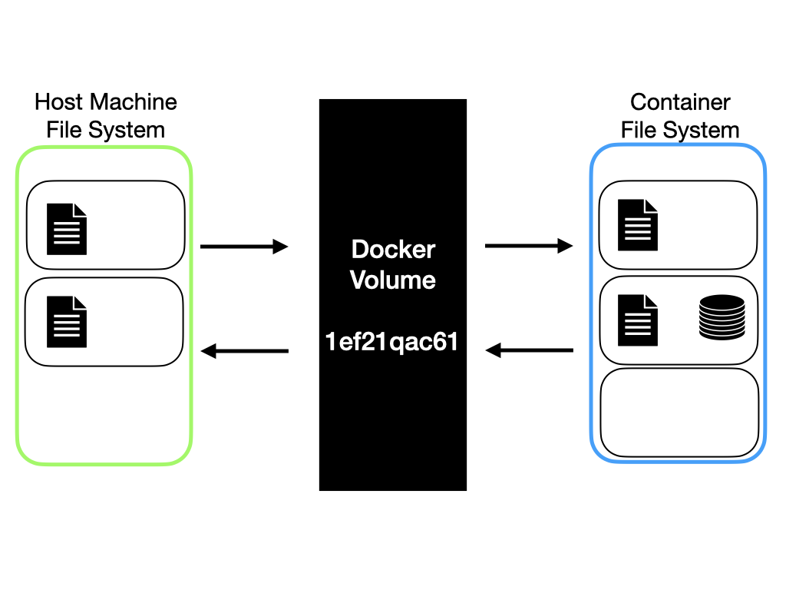


- 도커의 외부 데이터 저장소는 2가지 종류가 있음
  - 볼륨 : 익명볼륨(Anonymous Volumes)과 명명볼륨(Named Volumes) 두 볼륨 모두 도커가 호스트 머신에 특정 폴더와 경로를 지정함(사용자가 모르는).
  - 바인드 마운트 : 사용자가 직접 호스트 머신의 경로와 컨테이너의 파일 시스템을 매핑.

- 볼륨과 바인트 마운트 두가지 핵심 컨셉은 컨테이너에 정의된 경로가 이 두 타입의 데이터 스토리지 개념과 매핑된다는 것이다. 
  - **<u>호스트 머신의 파일시스템 <------> 컨테이너 파일시스템 <매핑>되는 개념으로 동작</u>**


### 1. 익명 볼륨

- 도커의 의해 컨테이너 생성 시에 자동으로 관리되는 볼륨.

- 컨테이너가 존재하는 동안만 존재, 컨테이너가 제거되면 데이터가 사라진다. 
  - 도커 컨테이너에 데이터를 저장하는 것이 아니므로 컨테이너가 실행중인 동안 필요한 임시/read용 데이터를 가지고 있는데 유용함. == 호스트 머신 파일시스템에 아웃소싱하는 개념
  - 도커 컨테이너를 띄울때 더 가볍게 사용할 수 있음. 더이상 컨테이너 내부에서 관리하지 않기 때문에 (성능 및 효율성에 도움)
- 컨테이너에 이미 존재하는 특정 데이터를 락킹하는데 유용함. 다른 모듈에 의해 오버라이팅 되는 것을 방지.
- **<u>특정 컨테이너에 의존적인 볼륨</u>**


- `--rm` 옵션으로 컨테이너를 시작/실행할 때만 컨테이너 제거시, 익명볼륨도 함께 사라짐 
  - 해당 옵션이 없이 컨테이너를 생성하고 컨테이너를 삭제하면, 사용한 익명볼륨은 그대로 남게되고 자동으로 삭제되지 않음
  - `docker volume rm [volume name]` `docker volume prune` 를 통해 남은 볼륨을 삭제할 수 있음.
  - **영구적으로 관리되어야할 데이터이거나 중요한 데이터에는 어울리지 않음**

- 익명 볼륨 생성 

  - 컨테이너 생성 시 `-v` 옵션을 통해 사용 가능 

  - ````
    docker run ... -v [container file system] ...
    ex) docker run ... -v /app/feedback ...
    ````

  - Dockerfile 을 통해 생성 가능 

    ```
    VOLUME ["/app/dev"]
    ```

    


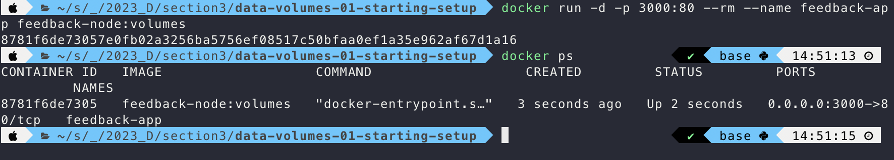

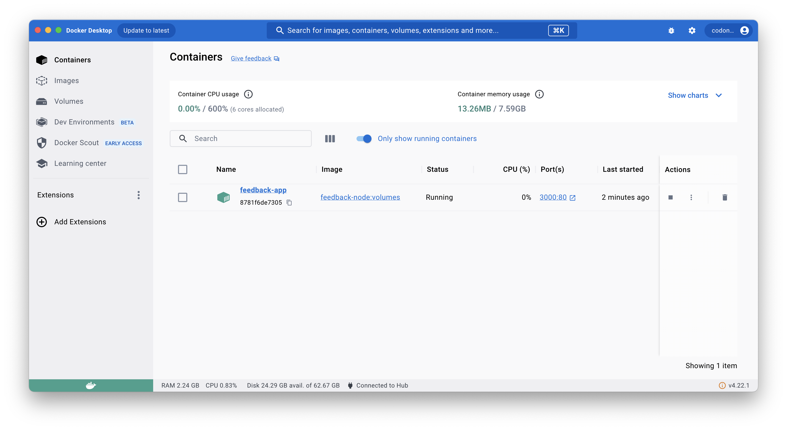

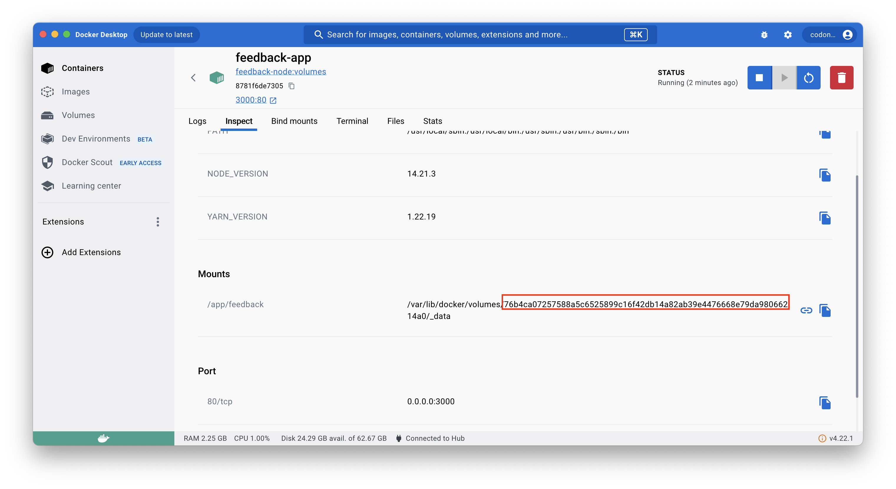


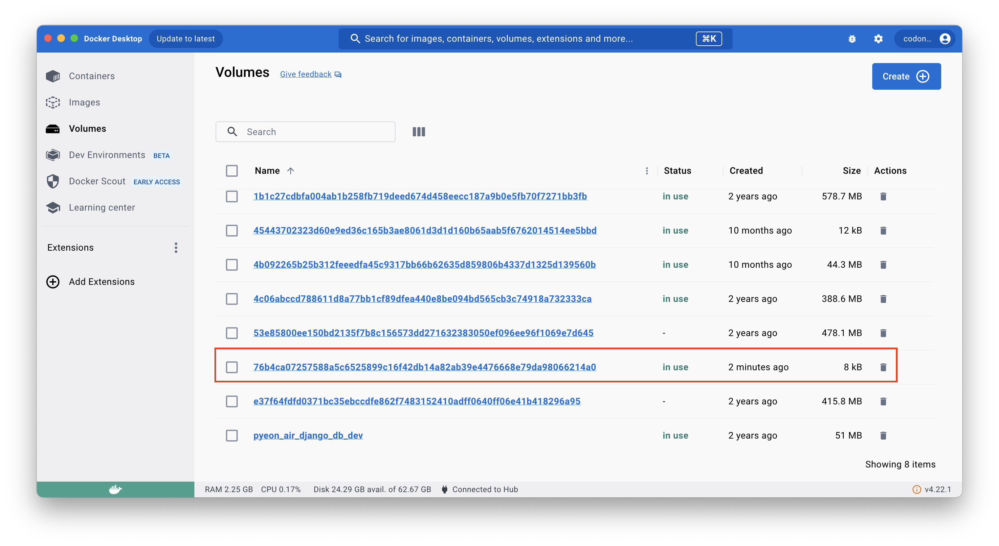

- 생성된 익명볼륨을 사용하는 컨테이너를 제거하자 해당 컨테이너와 매핑되어있던 익명볼륨도 삭제 됨.

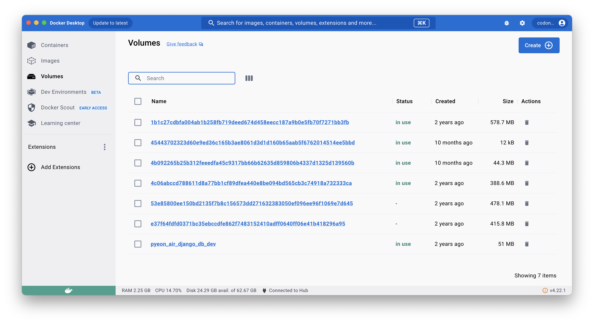

### 2. 명명 볼륨

- 컨테이너가 종료되어도 볼륨이 유지됨. 
- 이후에 새 컨테이너를 시작할 경우 **<u>볼륨이 복구되고</u>** 해당 폴더에 저장된 데이터를 사용할 수 있음.
  - Container ID 가 달라도 해당 볼륨을 사용할 수 있다.
- **<u>영구적</u>**으로 저장되어야 하거나, **<u>직접적으로 수정할 필요</u>**가 없는 중요한 데이터에 적합하다.
- **<u>특정 컨테이너에 의존적이지 않음</u>** -> 재사용 가능


- 명명 볼륨 생성

  - 컨테이너 생성 시 `-v` 옵션을 통해 사용 가능 

    ```
    docker run ... -v [volume name]:[container file system] ...
    ex) docker run ... -v feedback:/app/feedback ...
    ```


- 연결된 "feedback"이라는 이름의 볼륨에 파일이 저장되는 것을 확인할 수 있음.

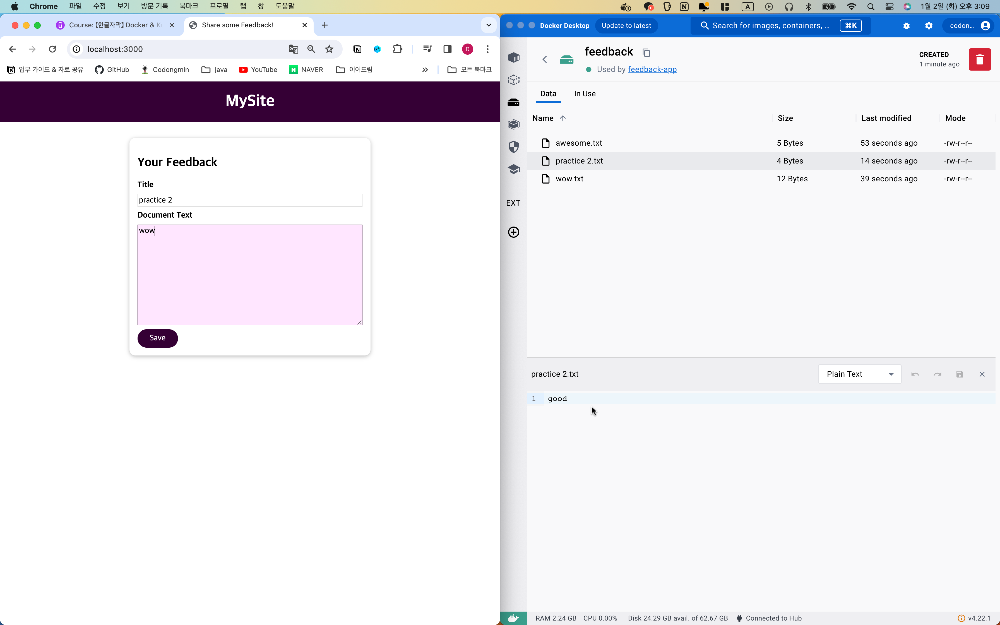

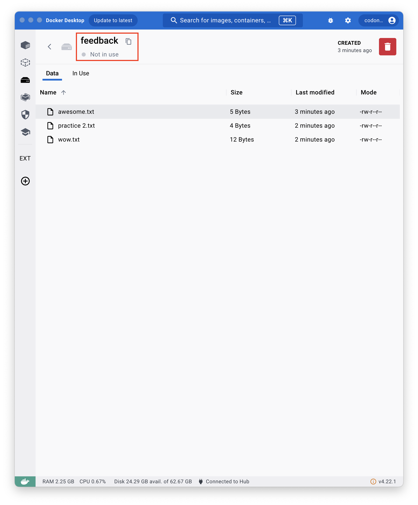

## 3. 바인드 마운트 


- 바인드 마운트의 경우 볼륨과 다르게 "직접" 호스트 머신의 경로를 지정해 매핑할 수 있다.
- 때문에 컨테이너는 바인드 마운트된 호스트 머신의 파일/폴더에 접근할 수 있음. 
- 그렇게 되면, **변경이 필요한** 소스코드를 이미지로 빌드시켜 static하게 만드는 것이 아닌 볼륨에 위치시켜 dynamic하게 변경할 수 있음.
- **<u>영구적</u>**이고, **<u>편집 가능한</u>** 데이터에 적합함.


- 바인드 마운트 설정

  - 컨테이너 생성 시 `-v` 옵션을 통해 사용 가능 

  - 단 호스트머신의 실제경로(절대)를 입력해야 한다.

  - ```
    docker run ... -v [host file system(absolute path)]:[container file system] ...
    ex) docker run ... -v /User/home/package:/app/feedback ...
    ```

  - 실제 매번 경로를 다 타이핑 하기 힘들다면 다음과 같이 쉘 명령어를 넣어도 가능하다.

    ```
    ex) docker run ... -v $(pwd):/app/feedback ...
    ```


- 도커는 로컬 호스트의 파일시스템에 write 하지 않음 
- 도커는 모든 볼륨을 평가함.
  - 연결되는 볼륨중 컨테이너 path의 depth 가 높은 순서대로 볼륨은 연결함. 
  - depth의 차이로 볼륨의 연결 범위를 간접적으로 설정할 수 있음. 

```
docker run ... --name feedback-app 
-v /Users/dev:/app:ro
-v feedback:/app/feedback 
-v /app/node_modules 
feedback-node:env
```

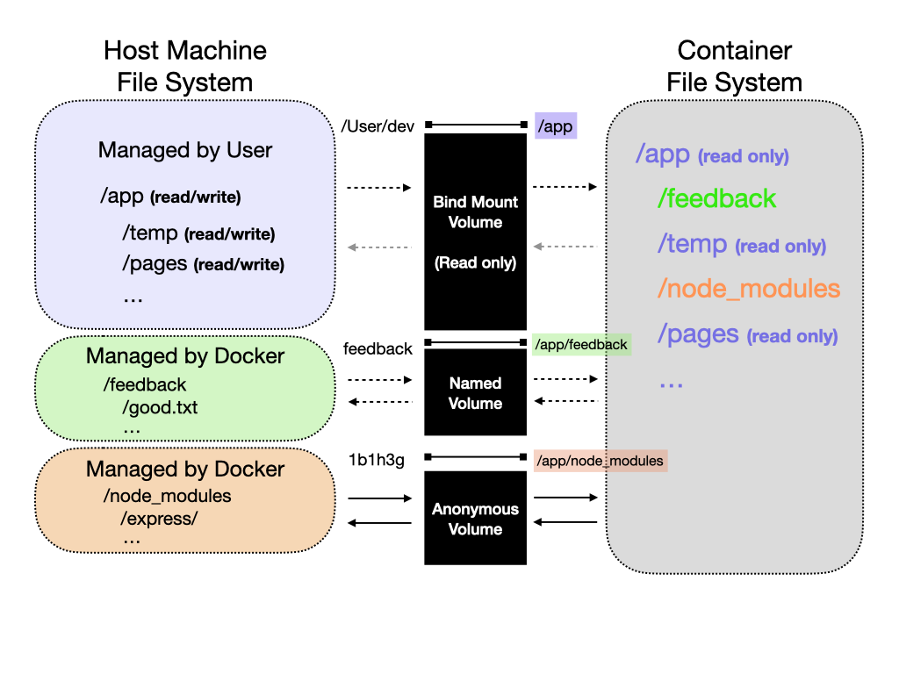

- `app/feedback`과 `/app/node_modules` 의 depth가 더 깊기 때문에 각각 해당 볼륨의 설정(익명 볼륨, 명명 볼륨)이 적용되고, 
- 앞선 path를 제외한 더 낮은 depth의 `/app` 에 속하는 폴더와 파일들은 바인드 마운트 되며, `:ro` read only 옵션에 따라 컨테이너 파일 시스템에서 해당 path 에 속하는 폴더와 파일들은 read only 권한만 부여됨. 
  - Write 할 수 있는 권한은 호스트 머신에서만 가지고 있음. 
- 위 그림에서 실선 화살표는 컨테이너에 의존적인 관계를 가지는 익명 볼륨의 특징을 나타내기 위함이며, 점선은 컨테이너에 언제든 마운트될 수 있는 볼륨임을 표시하고자 함.


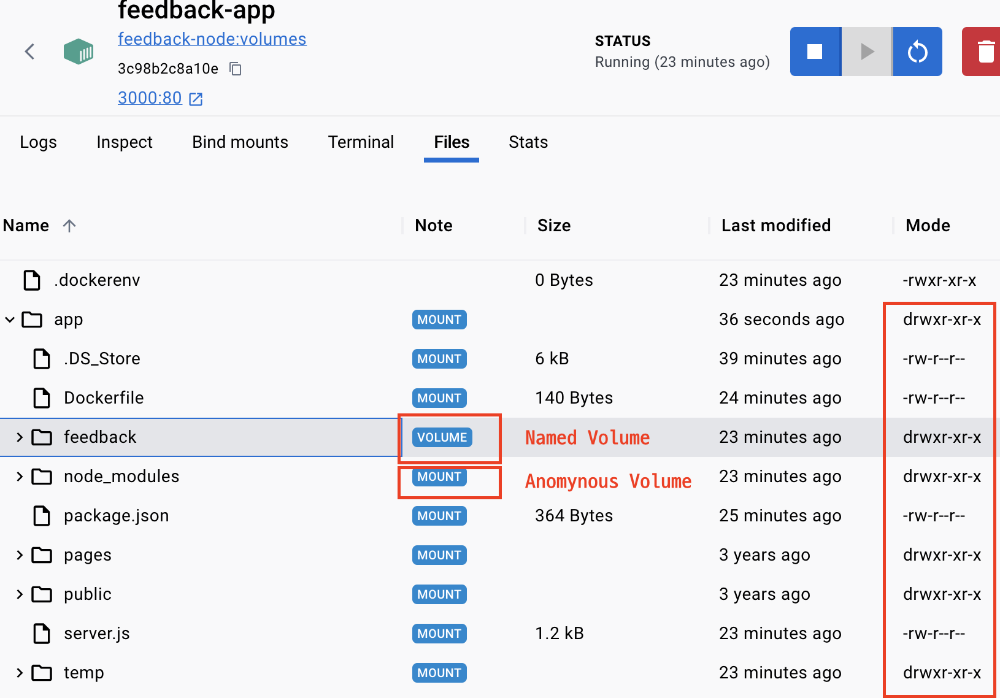

### COPY vs Bind Mount

- 개발 단계에서는 바인트 마운트를 사용하여 설정 및 소스 코드 변경을 통한 개발을 진행할 수 있음.
- 라이브 단계에서는 주로 실시간으로 소스코드를 변경할 일이 없기 때문에 사용하지 않음.


- 라이브를 위한 스냅샷(소스코드, 라이브에 필요한 기타 파일 등)을 이미지를 포함하기 위해 COPY 명령어를 사용함. 


## 읽기 전용 볼륨

- 바인드 마운트의 경우 호스트 머신의 파일 시스템과 컨테이너의 파일 시스템이 매핑되었기 때문에 서로 read/write가 가능함. 
- 하지만 볼륨을 생성할때 특정 옵션을 추가하여 해당 볼륨의 (컨테이너 내부에 한해서) 접근 권한을 설정할 수 있음. 
  - 볼륨의 기본값은 read/write 임. 
  - ro : read only

- read only 옵션을 적용할 경우 
  - 컨테이너의 파일시스템 -> 옵션을 적용한 경로의 파일과 폴더를 읽기 전용으로만 사용 가능
  - 호스트 머신의 파일 시스템 -> 옵션에 아무런 영향을 받지 않음, 읽기/수정 자유로움.

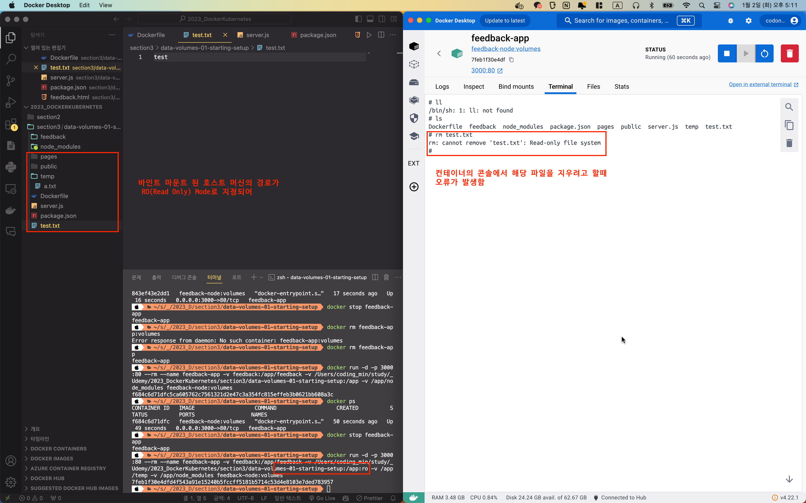


## 도커 볼륨 관리

- 도커 볼륨을 생성하고 조사하고 여러 볼륨들을 조회할 수 있음
  - `docker volume create [volume name]` 생성
  - `docker volume inspect [volume name]` 조사
  - `docker volume ls` 조회
  - `docker volume ls` 조회


## .dockerignore

- git ignore 파일처럼 COPY 명령으로 (이미지를 빌드함에 있어) 복사에서 제외할 파일과, 폴더를 지정할 수 있음.
  - 빌드할 이미지에 포함되어야 할 파일을 설정할 수 있음.


## 환경변수 

- 빌드 인수와 런타임 환경 변수를 설정할 수 있음.
  - 빌드인수 
    - 빌드시에 사용하는 설정 인수 
    - 도커 파일에서 사용 가능
  - 런타임 환경 변수
    - 도커파일 내부에서 사용가능
    - 실행중인 전체 애플리케이션 코드에서 사용가능
    - dockerfile의 ENV 옵션으로 run 상황에 필요한 구체적인 옵션을 설정할 수 있음.
- 유연한 빌드, 런 가능

### 빌드 인수 

```dockerfile
ARG DEFAULT_PORT=80 // CMD에서는 사용불가(RUNTIME 명령이기 때문) 
ENV PORT $DEFAULT_PORT
```

- 빌드 인수는 최대한 하단에 위치 시키도록 하여 이미지 빌드시에 불필요한 레이어 재생성을 막아 최적화 할 수 있음.

```shell
ex) docker build -t feedback-node:dev --build-arg DEFAULT_PORT=8000 .
```

예를 들어) 개발단계의 데이터베이스를 연결하기 위한 포트는 8080이고, 테스트 단계의 데이터베이스를 연결하기 위한 포트는 8888 일때, 서로 다른 구성으로 컨테이너를 실행해볼 수 있음


### 런타임 환경 변수

```
// 전역변수를 사용
app.listen(process.env.PORT);
```

```
...
ENV PORT 80 // 전역변수 설정 가능
...
```

```
docker run ... -p 3000:8000 --env PORT=8000 ...
docker run ... -p 3000:8000 -e PORT=8000 ...
docker run ... -p 3000:8000 --env-file ./.env ...
```


예를 들어) 개발단계의 데이터베이스를 연결하기 위한 포트는 8080이고, 테스트 단계의 데이터베이스를 연결하기 위한 포트는 8888 일때, 서로 다른 구성으로 컨테이너를 실행해볼 수 있음.


 >두 옵션 모두, 서로 다른 모드, 다른 구성에서 하나의 동일한 이미지를 기반으로 하나의 동일한 컨테이너를 실행하는데 도움이 됨. 


## 보안

**환경 변수 및 보안**에 대한 한 가지 중요한 참고사항: 환경 변수에 저장하는 데이터의 종류에 따라, 보안 데이터를 `Dockerfile`에 직접 포함하고 싶지 않을 수도 있습니다.

그 대신 런타임에만 사용되는 별도의 환경 변수 파일로 이동시키죠. (즉, `Docker run`으로 컨테이너를 실행할 때).

그렇지 않으면, 값이 **<u>'이미지에 포함'</u>**되며, 모든 이가 'docker history <이미지>'를 통해, 이 값을 읽을 수 있습니다.

일부 값의 경우, 이것이 중요하지 않을 수도 있지만, **<u>자격 증명, 개인 키 등의 경우에는 확실히 피해야만 합니다!</u>**

별도의 파일을 사용하는 경우, '`docker run`'을 실행할 때 그 파일을 가리키므로, 그 값은 이미지의 일부분이 아닙니다. 하지만 소스 컨트롤을 사용하는 경우, 별도의 파일을 소스 컨트롤 저장소의 일부분으로 커밋하지 않도록 조심하세요.


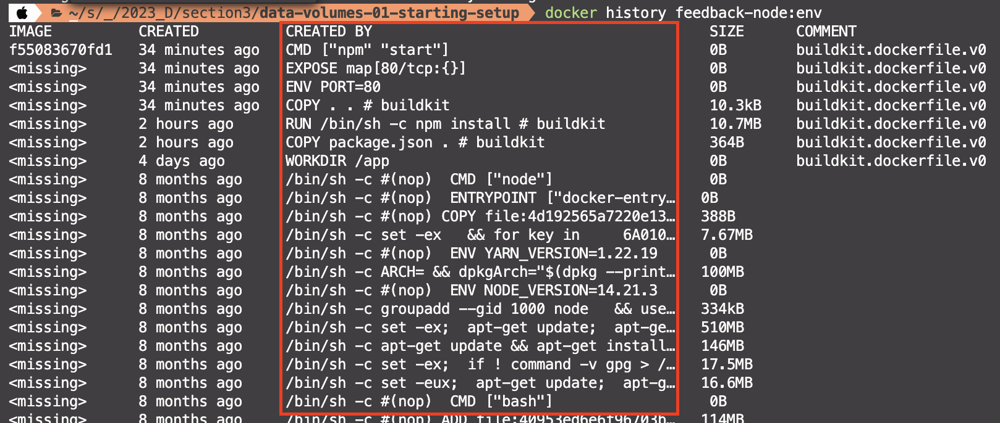


# 함께 이야기하고 싶은 점


```
-v [container path] // 익명볼륨
-v name:[container path] // 명명볼륨
-v /local/path:[container path] // 바인드마운트
```


이름을 명명한다는 것의 의미

- 그것을 나타내기 위한 약속 : 기억할 필요가 있다.
  - Why?  찾기 쉽기 때문
    - 재사용될 필요가 있다?!


Node_modules 폴더 생성
