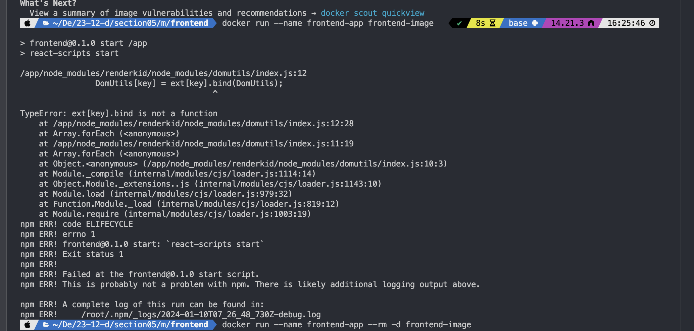

# 새롭게 알게된 점

## 컨테이너 간 통신 시나리오 세 가지

### 1. 컨테이너 → www 통신 요청

별도의 설정이 필요없다.

### 2. 컨테이너 → 호스트 머신에서 실행되는 다른 애플리케이션 요청

- Docker 컨테이너 내부에서 인식하는 URL로 변경한다.

  `host.docker.internal`

  ```javascript
  // as-is
  mongoose.connect(
    "mongodb://localhost:27017/swfavorites",
    { useNewUrlParser: true },
    (err) => {
      if (err) {
        console.log(err);
      } else {
        app.listen(3000);
      }
    }
  );

  // to-be
  mongoose.connect(
    "mongodb://host.docker.internal:27017/swfavorites",
    { useNewUrlParser: true },
    (err) => {
      if (err) {
        console.log(err);
      } else {
        app.listen(3000);
      }
    }
  );
  ```

### 3. 컨테이너 → 다른 컨테이너 요청

- `docker container inspect CONTAINER_NAME`으로 컨테이너의 IP 주소를 알 수 있다.
- < 네트워크 >

  컨테이너 간 통신을 허용하는 공간.

  Docker 네트워크에서는 모든 컨테이너가 서로 통신할 수 있으며 IP 조회 및 해결 작업을 자동으로 수행한다.

  #### 3-1. 네트워크 생성

  - Docker는 네트워크를 자동으로 만들지 않기 때문에 미리 생성한다

  - `docker network create NETWORK_NAME `

  #### 3-2. IP 주소를 연결하고 싶은 컨테이너 이름으로 변경한다.

  ```javascript
  // as-is
  mongoose.connect(
    "mongodb://172.17.0.2:27017/swfavorites",
    { useNewUrlParser: true },
    (err) => {
      if (err) {
        console.log(err);
      } else {
        app.listen(3000);
      }
    }
  );

  // to-be
  mongoose.connect(
    "mongodb://mongodb:27017/swfavorites",
    { useNewUrlParser: true },
    (err) => {
      if (err) {
        console.log(err);
      } else {
        app.listen(3000);
      }
    }
  );
  ```

  #### 3-3. 컨테이너 빌드 시 네트워크를 연결한다.

  `docker run --name CONTAINER_NAME --network NETWORK_NAME -d --rm IMAGE_NAME`

  > [Docker가 IP 주소를 다루는 방법]<br>
  > Docker는 소스 코드를 내부적으로 교체하지 않는다.<br>
  > Docker는 컨테이너의 이름을 보고 코드에 플러그인된 컨테이너의 IP 주소를 연결한다.<br>
  > 애플리케이션이 HTTP 요청이나 mongoDB 요청 또는 컨테이너에서 다른 종류의 요청을 보내는 경우 Docker가 이를 인식한다.<br>
  > 이 때, `host.docker.internal`, 주소, 컨테이너 이름을 실제 IP 주소로 변경한다.

### TMI: mongodb install

```bash
brew tap mongodb/brew
brew update
```

를 했더니 다음과 같은 오류가 떴다.

```bash
fatal: couldn't find remote ref refs/heads/master
Error: Fetching /opt/homebrew/Library/Taps/heroku/homebrew-brew failed!
Error: Some taps failed to update!
The following taps can not read their remote branches:
  heroku/brew
This is happening because the remote branch was renamed or deleted.
Reset taps to point to the correct remote branches by running `brew tap --repair`
```

그래서 하라는 대로 했더니 됐다!

```bash
brew tap --repair
brew install mongodb-community@7.0
brew services start mongodb-community@7.0
brew services list
```

## [실습] Docker로 다중 컨테이너 애플리케이션 구축하기

### 요구 사항

| DB                                          | Backend                                                       | Frontend                                 |
| ------------------------------------------- | ------------------------------------------------------------- | ---------------------------------------- |
| ∙ mongoDB<br>∙ 데이터 유지<br>∙ 엑세스 제한 | ∙ NodeJS<br>∙ 로그 데이터 유지<br>∙ 실시간 소스 코드 업데이트 | ∙ ReactJS<br>∙ 실시간 소스 코드 업데이트 |

### 강의 듣기 전 미리 해 본 시도

#### DB

- network 만들어주기

  ```bash
  docker network create goalapp-net
  ```

- mongodb - volume 생성

  ```bash
  docker volume create goalapp-db
  ```

- network 연결해주기

  ```bash
  docker run -d --name mongodb -v goalapp-db:/course-goals --network goalapp-net mongo
  ```

- mongodb 컨테이너 이름으로 바꿔주기

  ```jsx
  // app.js
  mongoose.connect(
    "mongodb://mongodb:27017/course-goals",
    {
      useNewUrlParser: true,
      useUnifiedTopology: true,
    },
    (err) => {
      if (err) {
        console.error("FAILED TO CONNECT TO MONGODB");
        console.error(err);
      } else {
        console.log("CONNECTED TO MONGODB");
        app.listen(80);
      }
    }
  );
  ```

#### Backend

- backend-image 생성

  ```docker
  FROM node:14

  WORKDIR /app

  COPY package.json .

  RUN npm install

  COPY . .

  CMD ["node", "app.js"]
  ```

  ```bash
  docker build -t backend-image .
  ```

- backend-container 생성

  - volume
  - network
  - port
  - bind-mount

  ```bash
  docker run -d --name backend-app -v goalapp-logs:/app/logs -v "$(pwd)":/app --network goalapp-net backend-image
  ```

#### Frontend

- Front 이미지 생성

  ```bash
  docker build -t frontend-image .
  ```

- frontend-container 생성

  - network
  - port
  - bind-mount

  ```bash
  docker run -d --name frontend-app -v "$(pwd)":/app -p 3000:3000 --network goalapp-net frontend-image
  ```

  이미 포트가 할당되어 있다는 에러가 나와서 3000에 있는 컨테이너 중지하고 다시 해도 안됐다.

  

  해당 에러는 Node 버전이 맞지 않아서 deprecated된 코드가 있었던 것이다. 애플리케이션이 스스로 중지됐기 때문에 `localhost:3000`에서 응답하지 않았던 것. 그래서 node 버전은 14, lastest로 다 해 봤는데도 관련된 오류가 발생했다. <br>
  → 해결 방법: 애플리케이션 단의 `node_modules`, `package-lock.json`을 지우고 다시 빌드하니 해당 오류가 발생하지 않았다.

### 강의에서 제시한 방법

(상세 설명은 이전 시도과의 차이점 위주로 작성하였다.)

#### DB

- mongoDB에서 인증을 추가하기 위해 `MONGO_INITDB_ROOT_USERNAME`, `MONGO_INITDB_ROOT_PASSWORD`을 추가했다.
  [관련 공식 문서](https://hub.docker.com/_/mongo#:~:text=mongo/mongod.conf-,Environment%20Variables,-When%20you%20start)
- 그리고 볼륨 연결할 때 데이터베이스를 명시하는 게 아니라 `/data/db`의 prefix로 연결한다.

  ```bash
  docker run --name mongodb -v DATA_VOLUME_NAME:/data/db --rm -d --network NETWORK_NAME -e MONGO_INITDB_ROOT_USERNAME=NAME -e MONGO_INITDB_ROOT_PASSWORD=PASSWORD mongo
  ex)
  docker run --name mongodb -v goalapp-data:/data/db --rm -d --network goalapp-net -e MONGO_INITDB_ROOT_USERNAME=my_name -e MONGO_INITDB_ROOT_PASSWORD=my_password mongo
  ```

#### Backend

- port 번호를 명시해주는 것을 누락시켰다.
- 익명 볼륨으로 node_modules가 덮어씌여지지 않는 것을 누락시켰다.

  ```bash
  docker run --name CONTAINER_NAME -v "$(pwd)":/app -v logs:/app/logs -v /app/node_modules --rm -p 80:80 --env MONGODB_USERNAME=NAME --env MONGODB_PASSWORD=secret -d --network NETWORK_NAME IMAGE_NAME
  ex)
  docker run --name backend-app -v "$(pwd)":/app -v logs:/app/logs -v /app/node_modules --rm -p 80:80 --env MONGODB_USERNAME=my_name --env MONGODB_PASSWORD=my_password -d --network goalapp-net backend-image
  ```

- 환경 변수를 넣는 방법으로는 다음과 같이 Dockerfile에 명시하는 방법도 있다.

  ```Docker
  # ...

  ENV MONGODB_USERNAME=my_name
  ENV MONGODB_PASSWORD=my_password

  # ...
  ```

#### Frontend

- 실시간 코드 변경을 위한 바인드 마운트 설정 시 경로가 app도 가능하지만 조금이라도 부하를 줄이기 위해 `/app/src`로 설정한다.
  ```bash
  docker run --name CONTAINER_NAME -v "$(pwd)"/src:/app/src --rm -p 3000:3000 -it IMAGE_NAME
  ex)
  docker run --name frontend-app -v "$(pwd)"/src:/app/src --rm -p 3000:3000 -it frontend-image
  ```

# 느낀 점

강의를 듣기 전 요구 사항에 따라 직접 실습해 보았는데, 데이터베이스 빌딩 블록, 백엔드 빌딩 블록은 도커화시키는 것을 성공했지만 프론트엔드 빌딩 블록까지 하는 것은 실패했다. 그래도 강의를 들으면서 어떤 것이 문제였는지 파악할 수 있었고, 내가 누락시킨 디테일을 다시 잡고 가니 내가 어느 정도 이해했는지 알 수 있었다.

# 함께 이야기하고 싶은 점

각자 강의를 들으면서 생기는 의문점에 대해 어느 depth까지 파고드는지 궁금합니다.
