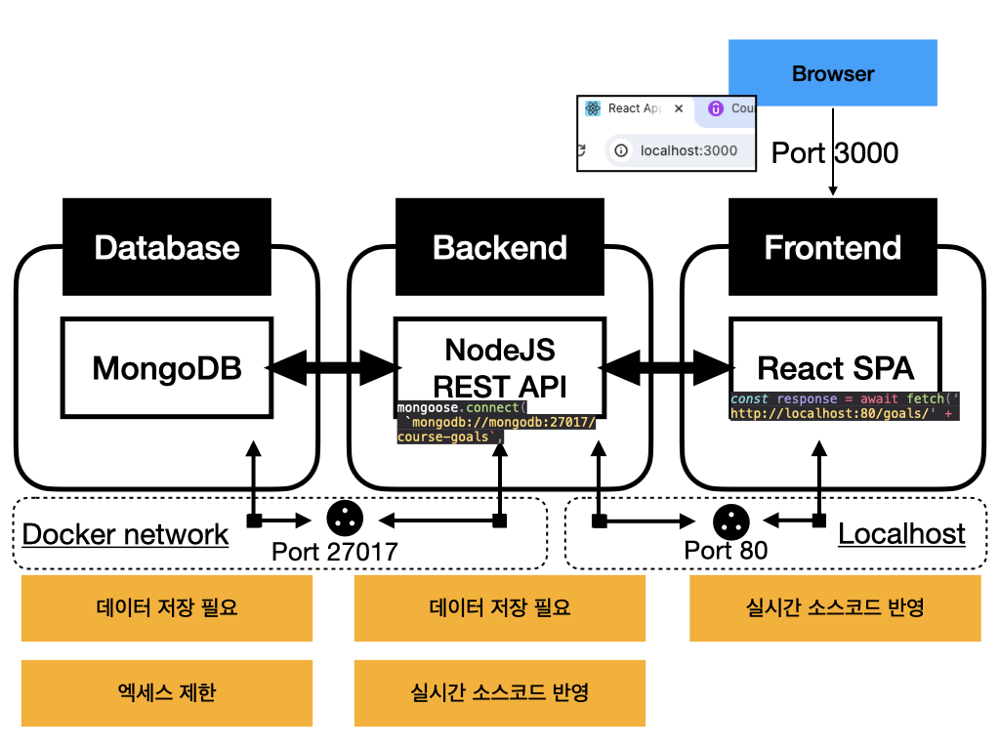
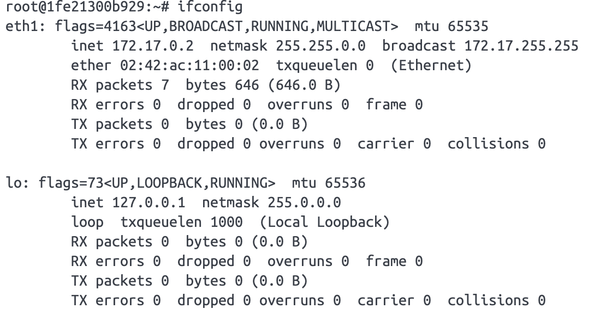
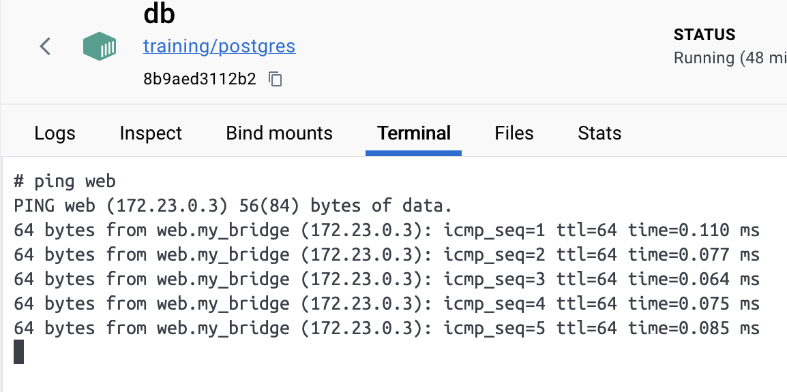
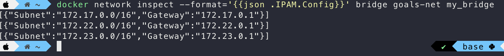

# 새롭게 알게된 점

- 컨테이너와 네트워크 
  - 컨테이너 외부와 통신하고 싶을때 
- 컨테이너끼리 통신 


## chapter4. 네트워킹: (교차) 컨테이너 통신

### 컨테이너 통신 시나리오 

- 컨테이너 <-> www

  - 컨테이너에서  외부 인터넷에 접근해서  HTTP 요청하는 방법
  - 서버의 API에 요청을 보내기 위한 과정
  - **<u>도커화된 컨테이너에서 HTTP요청을 외부 API 보내는 것은 특정한 설정 없이 가능함.</u>**

  

- 컨테이너 <-> 애플리케이션

  - 컨테이너 -> 호스트 머신에서 실행중인 특정서비스에 연결

  - ```
    []://host.docker.internal:[port]
    ```

  - 도메인 url이 필요한 곳에서 `host.docker.internal` 도메인 키워드는 로컬 호스트의 IP주소를 대신함


- 컨테이너 <-> 컨테이너
  - 컨테이너(애플리케이션) -> 컨테이너(서비스)에 연결
  - 컨테이너 자체 IP Address를 이용하여 


컨테이너에는 하나의 애플리케이션만, 포함되도록 권장

### 네트워크 

컨테이너가의 통신을 허용하는 네트워크 

docker run --network로 하나의 동일한 네트워크를 생성할 수 있음. 

고유한 네트워크에 포함된 다수의 격리된 컨테이너를 갖게됨. 

네트워크는 볼륨과 달리 도커에서 자동으로 설치되지 않음 

```
docker network create [network name]
```

```
[]://[conatiner name]:[port]
```

- 도메인 url이 필요한 곳에서 같은 네트워크를 공유할때, 컨테이너 이름으로 도메인 키워드를 사용가능. 컨테이너의 IP 주소 대신 컨테이너 이름으로 대체
- 동일한 네트워크 안에 있을때만 자동으로 변환됨 


---


## chapter5. Docker로 다중 컨테이너 애플리케이션 구축하기 (실습)

- 하나의 애플리케이션을 위한 여러 서비스와 함께 작동하는 다중 컨테이너 구성
- 데이터 베이스, 웹서버, 프론트엔드 애플리케이션 


### 실습 애플리케이션 구성

- 데이터베이스 MongoDB

- 백엔드 NodeJS REST API

- 프론트엔드 React SPA


1. 각각의 컨테이너를 띄우고 로컬호스트를 매개체로 하여 통신
2. 별도의 도커 네트워크를 통해 통신




# 함께 이야기하고 싶은 점


도커는 네트워크 드라이버를 통해 컨테이너들의 네트워킹 기능을 지원합니다. 기본값으로 도커는 `bridge`와 `overlay`라는 두가지 네트워크 드라이버를 제공합니다. 사용자가 직접 많은 작업을 수행하기 위한 고유의 네트워크 드라이버 플러그인을 만드는 것도 가능합니다.


도커 엔진은 자동적으로 기본 네트워크 3개를 포함합니다.

**NETWORK ID     NAME                                       DRIVER    SCOPE**
2bb78239a91a   bridge                                     bridge    local
0e6bca8f89ba   host                                       host      local
0d6043aa7139   none                                       null      local

네트워크 이름이 `bridge` 는 특수한 네트워크 입니다. 다른 네트워크를 설정하지 않는 한 도커는 항상 컨테이너를 이 네트워크에 띄우게 됩니다. 도커 이미지를 이용하여 컨테이너를 띄우게 되면 다음과 같은 모습이 됩니다.


**컨테이너를 실행하게 되면 호스트에 veth 인터페이스가 할당**됩니다. **veth(virtual ethernet) 인터페이스는 가상의 네트워크 인터페이스로, 자신과 연결된 컨테이너의 네트워크 인터페이스와 패킷을 주고받는 식으로 동작**합니다.

이는 **사용자가 직접 생성할 필요없이 도커가 자동으로 생성**해주며, **veth 인터페이스는 항상 쌍으로(pair)로 생성**됩니다.

하나는 **vethxxxx라는 이름으로 호스트에 생성되며 docker0에 바인딩 되는 형식**이고, 하나는 **컨테이너 내부에 eth0 라는 이름으로 생성되어 veth 인터페이스와 연결되는 방식**입니다.


이때 네트워크를 조사해보면 컨테이너의 IP address를 찾을 수 있습니다. 

```
    ~  docker network inspect bridge                                  ✔  base   
```

```bash
[
    {
        "Name": "bridge",
        "Id": "2bb78239a91abfad6ed1457dc170b1a20707941ec5072b0de912c49f4c3791f6",
        "Created": "2024-01-10T04:55:44.240100144Z",
        "Scope": "local",
        "Driver": "bridge",
        "EnableIPv6": false,
        "IPAM": {
            "Driver": "default",
            "Options": null,
            "Config": [
                {
                    "Subnet": "172.17.0.0/16",
                    "Gateway": "172.17.0.1"
                }
            ]
        },
        "Internal": false,
        "Attachable": false,
        "Ingress": false,
        "ConfigFrom": {
            "Network": ""
        },
        "ConfigOnly": false,
        "Containers": {
            "1fe21300b9291762f1fe1ca21b975066918785b97ad03605f85f3ac10c2081ef": {
                "Name": "networktest",
                "EndpointID": "9a5e300e467a501ae769e58efa633eff747976598b7c795ee129ea54177864a9",
                "MacAddress": "02:42:ac:11:00:02",
                "IPv4Address": "172.17.0.2/16",
                "IPv6Address": ""
            }
        },
        "Options": {
            "com.docker.network.bridge.default_bridge": "true",
            "com.docker.network.bridge.enable_icc": "true",
            "com.docker.network.bridge.enable_ip_masquerade": "true",
            "com.docker.network.bridge.host_binding_ipv4": "0.0.0.0",
            "com.docker.network.bridge.name": "docker0",
            "com.docker.network.driver.mtu": "65535"
        },
        "Labels": {}
    }
]
```

우분투 컨테이너에서 조사한 네트워크



eth0 : 이더넷 카드 인터페이스

lo : 루프백 인터페이스(자기자신을 가리키기 위한 목적의 예약된 IP / net 127.0.0.1  netmask 255.0.0.0)

bridge의   "Subnet": "172.17.0.0/16","Gateway": "172.17.0.1", ip 네트워크 범위에 컨테이너가 IP를 할당받은 것을 확인할 수 있습니다.


하나의 컨테이너에 여러 네트워크 드라이브를 붙이는 것도 가능합니다. 


따라서 위의 그림에 따라 web 컨테이너는 ip 주소대를 2개를 가질 수 있음. 마치 네트워크 인터페이스 카드가 2개인것처럼 운용 가능 

다음과 같이 DB 컨테이너에서 Web 컨테이너로 ping 테스트가 성공하는 것을 볼 수 있음.




드라이버는 각각의 별도 네트워크=서브넷들을 가지는 일종의 NAT 역할을 하는 것으로 보인다. 

사설 IP 대역중 10, 172, 192대 중 172를 도커는 주로 사용하는 듯하다. 



또한 이러한 드라이버:서브넷들과 호스트 머신 포트를 서로 연결해주는 포트포워딩 기능, 서브넷안에서 IP를 배분하는 등하는 마치 가상 공유기, 스위치와 같은 역할자가 있지 않을까? 

도커 내부의 DNS도 있을 것으로 보임


### ⭐️libnetwork(CNM모델의 구현체, 도커 네트워크의 핵심 라이브러리)

Docker 네트워크 드라이버

Docker Networks는 실제로 네트워크 동작에 영향을 미치는 다양한 종류의 '**드라이버**'를 지원합니다.

디폴트 드라이버는 '**bridge**' 드라이버입니다. 이 드라이버는 모듈에 나타난 동작을 제공합니다 (즉, 컨테이너가 동일한 네트워크에 있는 경우, 이름으로 서로를 찾을 수 있음).

드라이버는 네트워크 생성 시 '`--driver`' 옵션을 추가하여 간단히 설정할 수 있습니다.

```
docker network create --driver bridge my-net
```

물론 'bridge' 드라이버를 사용하고자 하는 경우, 'bridge'가 디폴트이므로, 전체 옵션을 생략하면 됩니다.


### 도커의 드라이브 종류

Docker는 아래의 대체 드라이버도 지원하지만 대부분의 경우 'bridge' 드라이버를 사용합니다.

- **host**: 스탠드얼론 컨테이너의 경우, 컨테이너와 호스트 시스템 간의 격리가 제거됩니다 (즉, localhost를 네트워크로 공유함).
- **overlay**: 여러 Docker 데몬 (즉, 서로 다른 머신에서 실행되는 Docker)이 서로 연결될 수 있습니다. 여러 컨테이너를 연결하는 구식의 / 거의 사용되지 않는 방법인 'Swarm' 모드에서만 작동합니다.
- **macvlan**: 컨테이너에 커스텀 MAC 주소를 설정할 수 있습니다. 그러면 이 주소를 해당 컨테이너와 통신하는데 사용할 수 있습니다.
- **none**: 모든 네트워킹이 비활성화됩니다.
- **써드파티 플러그인**: 모든 종류의 동작과 기능을 추가할 수 있는 타사 플러그인을 설치할 수 있습니다.


언급했듯이 '**bridge**' 드라이버는 대부분의 시나리오에 가장 적합합니다.


```
Bridge ?
일반적인 네트워킹에서 브리지는 네트워크 세그먼트 간에 트래픽을 전달하는 링크 계층 장치입니다. 
브리지는 하드웨어 장치일 수도 있고 호스트 시스템의 커널 내에서 실행되는 소프트웨어 장치일 수도 있습니다.
*네트워크 세그먼트 : 네트워크 세그먼테이션은 네트워크를 여러 개의 세그먼트나 서브넷으로 나누는 아키텍처 방식으로, 각각이 소규모 네트워크 역할을 함
```

```
Docker에서 브리지는 컨테이너 간 통신을 할 수 있게 하는 소프트웨어 브리지 입니다. 
동시에, 서로 다른 브리지 네트워크에 연결된 컨테이너와 격리를 하기도 합니다.
```


### CNM

*Container Network Model*

도커 네트워크의 핵심 추상개념, 도커 네트워크의 구상의 기반이 된 모델

```
위와 같은 구성으로 마치 격리된 것 같은 네트워크 구조를 구성하고,
설정에 따라 로컬 컨테이너나 원격 컨테이너와 통신할 수도 있게 됩니다.
```

출처: https://gngsn.tistory.com/137 [ENFJ.dev:티스토리]

```
Libnetwork
CNM이 설계 문서라면, libnetwork는 그에 대한 표준 구현체입니다.
실제로 구현되어 Docker Network의 컨테이너 네트워킹이 가능하게 만들었죠.
 
Libnetwork는 위에서 소개한 Sandboxes, Endpoints, Networks를 모두 구현했습니다.
또, libnetwork는 오픈소스이며, Go로 작성되어 cross-flatform을 지원합니다.
libnetwork Repository에서 오픈소스 코드를 확인할 수 있습니다.
```

출처: https://gngsn.tistory.com/137 [ENFJ.dev:티스토리]


도커 네트워크

https://www.docker.com/blog/understanding-docker-networking-drivers-use-cases/

https://docs.docker.com/network/