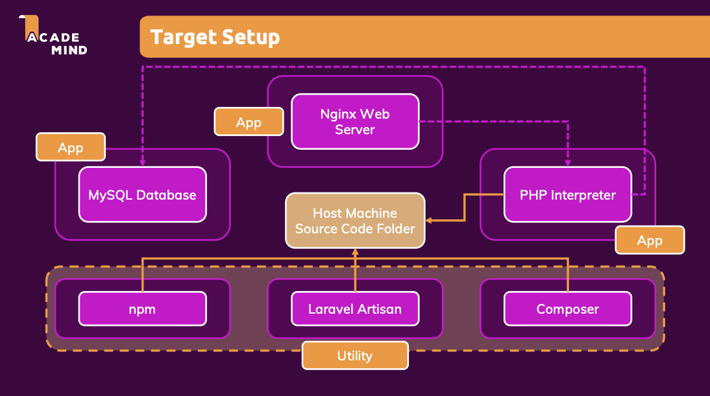

# 정리 및 새롭게 알게된 점
## Laravel & PHP 도커화 프로젝트

- Laravel: PHP 언어로 작성된 PHP로 웹 개발을 하기 위한 풀스텍 웹 프레임워크
- Artisan(아티즌): 라라벨에 포함된 커맨드라인 인터페이스(CLI)의 이름

```shell
# 일부 docker compose 서비스만 구동하기 : composer
docker-compose run --rm composer created-project --prefer-dist laravel/laravel .

# 일부 docker compose 서비스만 구동하기
docker-compose up -d server php mysql

# docker-compose는 Dockerfile을 수정했을 때 추척이 안됨. 이미지 리빌드 X
# Dockerfile을 추척하여 변경 시 이미지를 리빌드하도록 '--build'옵션 추가
docker-compose up -d --build server

# migrate: Larave이 지원하는 artisan 명령어. 데이터베이스에 데이터를 기록. 데이터베이스 설정이 작동하는지 여부 확인가능
docker-compose run --rm artisan migrate

```