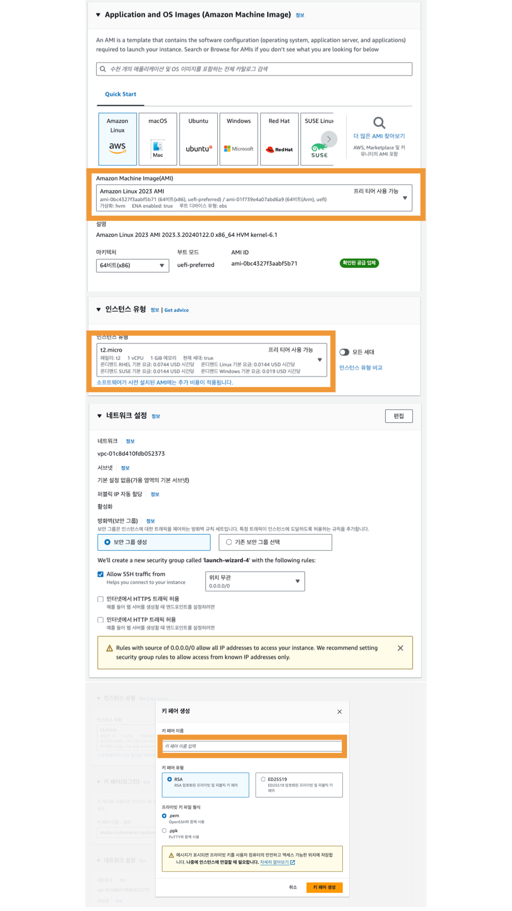
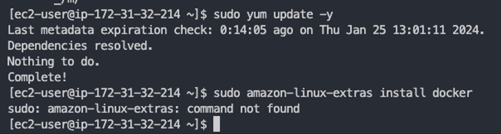
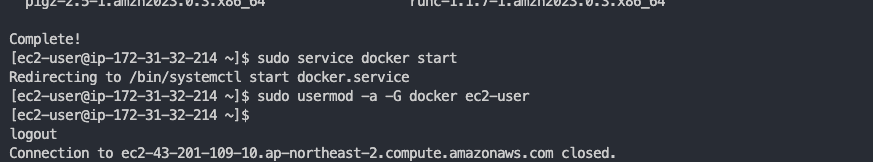
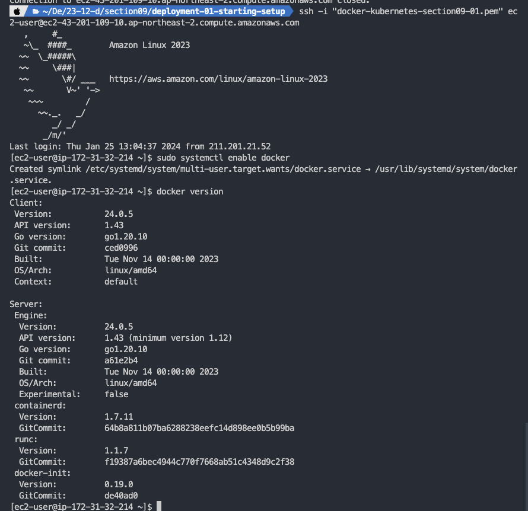
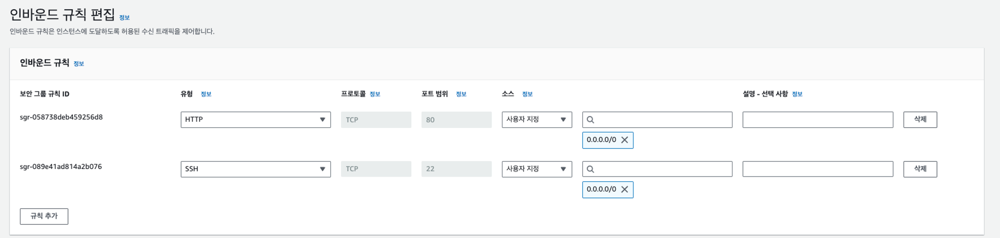

# 새롭게 알게된 점

## 컨테이너 배포 시 주의할 점

- 바인드 마운트는 프로덕션 단계 때 쓰지 마라!
- 컨테이너화 된 앱은 빌드 절차가 추가적으로 필요하다!
- 다중 컨테이너 프로젝트는 프로젝트, 컨테이너에 따라 분할여부가 결정된다!
- 배포 플렛폼을 덜 통제하는 더 쉬운 솔루션을 찾을 수 있다!
  - 제어 - 책임은 트레이드오프 관계에 놓여있다

> Standalone refers to a system or device that can operate independently, without external connections or dependencies. It can perform its intended functions without relying on other devices or networks.<br>
> Standalone은 외부 연결 또는 의존성없이 독립적으로 구동할 수 있는 시스템 또는 기기를 의미합니다. 다른 기기 내지 네트워크에 의존하지 않고 의도된 함수를 실행할 수 있습니다.
> <br> > [lenovo - What is a standalone system or device?](https://www.lenovo.com/us/en/glossary/standalone/?orgRef=https%253A%252F%252Fwww.google.com%252F)

## 배포 프로세스

> 🧑‍💻 Standalone NodeJS App

1. Image, Container 생성
2. remote host(SSH)에 Docker 설치
3. remote host에 push, pull 이미지
4. 컨테이너 실행 후 브라우저 테스트

## 호스팅 프로바이더

(현재는 벤더Vendor, 클라우드 서비스Cloud Service라고 불린다)

- AWS
- Microsoft Azure
- Google Cloud
- (국내) 네이버 클라우드

## AWS EC2에 배포하는 단계

1. EC2 인스턴스를 생성한다

   VPC, 보안그룹도 설정한다

2. 모든 포트를 WWW에 노출시키도록 보안 그룹 구성

   EC2 인스턴스로 들어오는 트래픽을 가질 수 있도록

3. SSH(Secure Shell)을 통해 인스턴스 연결

   리모트 머신에 연결하기 위한 특정 접근 방식

```bash
docker build -t IMAGE_NAME .
docker run -d --rm --name CONTAINER_NAME -p 80:80 IMAGE_NAME
```

## 개발 환경과 프로덕션 환경의 차이

- 각 환경마다 `docker run` 명령에서 다른 option을 사용하기 때문에 동일한 Dockerfile을 쓸 수 있는 것이다. <br>→ 항상 정확히 동일한 이미지로 작업하고, 개발 중에 더 많은 유연성을 갖도록 보장할 수 있는 방법

  > ❓ 각 단게별로 명령어를 다르게 가져가는 게 아니라 Dockerfile을 다르게 가져가는 게 휴면 이슈를 줄일 수 있다는 점에서 더 낫지 않나? 명령어 불편해잇!<br>
  > 항상 동일한 이미지로 작업하는 건 명령어가 달라지면 의미가 없는 말이지 않을까... 싶다!

- 프로덕션 환경에서는 컨테이너를 실행하는 위치에 관계 없이 모든 이미지가 어떤 추가 환경 구성, 코드없이도 동작한다.

## EC2 생성 및 SSH 연결

1. 이미지 환경 설정
2. 인스턴스 유형 설정
3. 네트워크 설정
4. 키 페어 설정 및 저장
5. 인스턴스 생성 완료



```bash
chmod 400 "PEM_KEY_NAME.pem"

ssh -i "PEM_KEY_NAME.pem" ec2-user@{퍼블릭 IPv4 DNS}
ex.
ssh -i "PEM_KEY_NAME.pem" ec2-user@ec2-43-201-109-10.ap-northeast-2.compute.amazonaws.com
```

## EC2에 Docker 설치하기

### 문제 상황

`sudo amazon-linux-extras install docker`가 지원되지 않음



### 해결 방법

```bash
sudo yum update -y
sudo yum -y install docker
```

```bash
sudo service docker start
sudo usermod -a -G docker ec2-user
// ssh 로그아웃 (ctrl + D)
```



```bash
// ssh 재로그인
sudo systemctl enable docker
docker version
// 설치 확인 완료
```



## 소스코드 배포 vs 이미지

option 1) 소스 배포

- 프로젝트 폴더의 모든 항목을 리모트 머신에 복사
- 불필요한 복잡한 것이 많음

option 2) 로컬 머신에서 미리 이미지 빌드

- 구축 이미지를 리모트 머신에 배치

---

```bash
// lost host machine
docker build -t IMAGE_NAME .
docker tag IMAGE_NAME REPOSITORY_NAME
docker push REPOSITORY_NAME
```

```bash
// ssh
docker run -d --rm -p 80:80 REPOSITORY_NAME
```

### platform 호환 문제

- 원인: mac M1과 AWS 인스턴스 간의 호환문제

```text
The requested image's platform (linux/arm64/v8) does not match the detected host platform (linux/amd64/v3) and no specific platform was requested
```

### 해결 방법

```bash
// AS-IS
docker build -t IMAGE_NAME .

// TO-BE
docker build -t --platform linux/amd64 IMAGE_NAME .
```

[참고: [Docker] 이미지 빌드 플랫폼 호환성 관련 에러 (linux/amd64) - msung99 velog](https://velog.io/@msung99/Docker-%EC%9D%B4%EB%AF%B8%EC%A7%80-%EB%B9%8C%EB%93%9C-%ED%94%8C%EB%9E%AB%ED%8F%BC-%ED%98%B8%ED%99%98%EC%84%B1-%EA%B4%80%EB%A0%A8-%EC%97%90%EB%9F%AC-linuxamd64)

- 인바운드 포트 규칙도 지정해주기
  

## 현재 접근 방식의 단점 - DIY 방식

- 리모트 머신의 구성에 대한 책임을 가져야 한다.
- 직접 보안 그룹, 네트워크도 관리해야 한다.
- SSHing, SSH 통해 머신 접근 등 배포 작업절차가 복잡해진다.

→ 그래서 관리형 리모트 머신인 ECS(Elastic Container Service)가 존재한다.<br>
→ 전체 생성 관리, 업데이트, 모니터링, 스케일링이 단순화된다<br>
→ 컨테이너 배포 및 컨테이너 실행이 더 이상 도커 명령으로 수행되지 않는다..!

## ECS의 4가지 범주

- 컨테이너
  - 자체 커스텀 컨테이너 선택
    - 커스텀 컨테이너 정의(이름/이미지/포트 매핑/환경 변수/로깅)
    - ECS가 나중에 `docker run` 을 실행하는 방법을 지정
- 태스크 정의
  - 애플리케이션의 블루프린트.
  - AWS는 실제로 컨테이너를 실행하는 EC2 인스턴스를 생성하지 않고, 컨테이너를 실행하는 방법과 컨테이너를 위해 어떤 환경을 설정해야 하는지
  - 기본적으로 FARGATE를 사용
    - 컨테이너를 시작하는 특정 방법(서버리스 모드에서 구동)
    - AWS는 실제로 컨테이너를 실행하는 EC2 인스턴스를 생성하지 않고 대신 컨테이너와 그 실행 설정을 저장
    - FARGATE를 EC2로 전환하여 AWS에 EC2 인스턴스를 생성하도록 하는 것도 가능함
    - 컨테이너가 실행 중인 시간에 대해서만 비용 지불한다는 점에서 효율적임
- 서비스
  - 태스크와 태스크 내의 컨테이너를 실행하는 방법을 제어
  - 로드밸런서 추가 가능
- 클러스터
  - 서비스를 실행하는 네트워크

> 👩‍💻 그런데 현재 AWS UI에서는 컨테이너, 서비스를 바로 찾을 수 없다... 새롭게 업데이트된 상태에서 다시 실습을 해야할 것 같다.

[AWS에 대한 추가 정보 - AWS VPC & Subnets | Amazon Web Services BASICS](https://www.youtube.com/watch?v=bGDMeD6kOz0)

## ECS 생성 및 설정

### push된 이미지 업데이트하는 법

- cluster → tasks → 실행 중인 task → create new revision
  - 같은 태스크 생성
- 또는 update service → force new deployment

구동되는 새 태스크 개정판에 대해 새로운 것을 생성하고 할당하기 때문에 ip도 새롭게 바뀐다!
