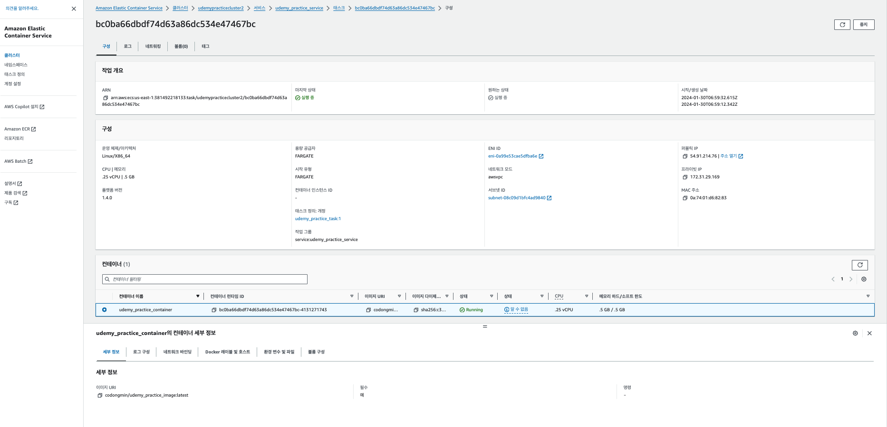

# 새롭게 알게된 점

- 클라우드에서 원격으로 실행되는 머신에서 배포 
- 로컬 개발부터 프로덕션 배포까지의 전반적인 과정
- 배포 시나리오, 예시, 문제점 파악


개발 환경과 배포 환경의 재현성 보장한다. == 도커 컨테이너를 사용하는 이유, 이 장점을 확인하고자 실습을 진행


**개발 환경 <->배포 환경 전환으로의 주의 사항** 

- 개발 환경(바인트 마운트) -> 최종 배포 단계(바인드 마운트 사용 X)

- 개발 환경과 다른 배포 환경만의 빌드 과정이 필요
- 멀티 컨테이너 프로젝트를 여러개의 호스트/원격 머신으로 분리하게 될 수 있음. 

- 서버 솔루션을 사용하면서 편리한 부분과 감당해야할 부분 


## Standalone nodejs app을 배포해보기 

1. 호스트 머신에서 원격 서버에 ssh로 접근하여 도커 설치
2. 도커 이미지를 도커 이미지 등록소(ex. 도커 허브)에 등록
3. 원격 서버에서 도커 이미지 pulliing
4. 원격 서버에서 도커 컨테이너 실행 
5. 원격 서버에서 웹 서버 포트 연결 & 오픈


### 호스트프로바이더 - AWS 를 사용하여 배포하기

실습 목표


Pre. 이미지 빌드 & 도커 허브 push

1. EC2 인스턴스를 생성하고 실행, VPC와 보안 그룹 설정 
2. 보안그룹을 WWW 포트로 노출
3. SSH로 인스턴스를 연결
   1. 도커 설치
   2. 도커 이미지 pull & 컨테이너 실행


> 이전 회사에서 이와 같은 구조를 가지고 갔었다. 다만 이미지 레포지토리(docker hub)와 서버(aws)는 자체 내부 서버안에서 해결했고, 
> 이미지 업데이트나, 서버 내의 관리는 스크립트로 짜서 사용했었음. 

### 바인트 마운트, 볼륨, COPY

|                           개발 시                            |                           배포 시                            |
| :----------------------------------------------------------: | :----------------------------------------------------------: |
| 런타임에 컨테이너는 캡슐화되어야 하지만, 코드는 그렇지 않아도 된다. | 컨테이너는 혼자서 동작해야하고, 원격 서버에는 의존하지 않는다. == 소스코드가 존재하지 않는다.<br />SSOT(*Single Source of Truth*)의 약어로, 데이터베이스, 애플리케이션, 프로세스 등의 모든 데이터에 대해 하나의 출처를 사용하는 개념 |
| "바인드 마운트"를 사용하여 실행중인 컨테이너에 로컬호스트의 프로젝트 파일을 제공한다. | "COPY" 명령어를 통해 코드의 스냅샵을 복사하여 이미지 레이어에 넣는다. |
| 컨테이너의 재가동 없이 즉각적인 (소스코드)업데이트를 허용한다. | 추가적인 주변 환경구성이나 코드없이 모든 이미지가 동작되도록 보장해야함. |


- 소스코드 복사 후 -> 이미지 빌드 -> 실행
  - 번거로움 

- 이미지 빌드 후 이미지만 복사 -> 실행 
  - 도커 허브를 사용하여 간편하게 실행 가능


#### Pre. 이미지 빌드 & 도커 허브 push

- 이미지 빌드 

  ```bash
  docker build -t node-dep-example .
  docker tag node-dep-example:latest udemy_practice_image:latest
  ```

- 도커 허브 레포 생성

- 도커 이미지 푸시

  ```bash
  docker push codongmin/udemy_practice_image:latest
  ```


#### 1. EC2 인스턴스를 생성하고 실행, VPC와 보안 그룹 설정 

- Aws ec2의 프리티어 가능한 유형으로 생성하고, 실행
- Ec2 대시보드에서 인스턴스 관련 정보를 확인할 수 있다. 
  - public IP, 상태, 고정 IP, 볼륨 등등


#### 2. 보안그룹을 WWW 포트로 노출

- 인스턴스로 들어오는 인바운드 규칙 추가 
- HTTP 80 포트로 들어오는 IP 대역 열어 접근 가능하게 설정


#### 3. SSH로 인스턴스 연결

```bash
ssh -i "udemy_practice_instance_key.pem" ec2-user@ec3-13-787-111-1.compute-1.amazonaws.com
```

- 만일 인스턴스의 보안그룹의 인바운드 규칙이 ssh를 허용하지 않는다면. 접속이 불가함. `connection time out`

- 다음과 같이 인스턴스의 보안 규칙을 추가 


#### 3-1. 도커 설치

- Updata

```bash
sudo yum update -y
sudo yum -y install docker
```

- Start Docker

```bash
sudo service docker start
```

- Access Docker commands in `ec2-user` user

```bash
sudo usermod -a -G docker ec2-user
sudo chmod 666 /var/run/docker.sock
docker version
```


#### 3-2. 도커 이미지 pull & 컨테이너 실행

```bash
# image pull from docker hub
docker pull codongmin/udemy_practice_image:latest

# run container
docker run -d --rm -p 80:80 --name udemy_practice_container codongmin/udemy_practice_image
```

- 이후 인스턴스의 public ip 를 통해 접속한다. 


### 현재 방식의 단점 

- 인스턴스를 수동으로 생성, 구성, 연결

- 도커 수동 설치, 구동


- 원격 서버의 모든 책임과 권한을 갖는다(보안 문제도)
  - 소프트웨어 업데이트 관리 
  - 네트워크, 방화벽 관리 
- sshing 으로 관리하는 것은 힘듦,귀찮음


> 자동으로 이미지가 원격서버로 이동되고 풀링하고 실행하는 환경을 원함 


### 수동 배포에서 관리형 서비스로 

- 완전한 통제와 그에따른 책임을 원하는지 < --- > 통제가 덜 한 상태를 원하는지 (트레이드 오프)


- 완전히 자체 관리되는 서비스(원격 호스트,EC2 ) 에서 서드파티 솔루션(ECS)으로 전환 


- 원격 인스턴스 (ec2) 

  - 직접 생성하고, 관리하고, 업데이트, 모니터링, 스케일링 해주어야 됨

  - 경험 많고, 커스터 마이징이 필요한 서비스나 전문가에게 적합


- 관리형 리모트 호스트 (AWS ECS)

  - 생성하고, 관리하고, 업데이트, 모니터링 자동화, 스케일링 쉬움


  - 쉽게 앱/컨테이너를 배포하고 싶은 사람에게 적합 

  - 툴을 사용하는 법을 익혀야 함. 


### ECS 

>  Amazon Elastic Container Service(ECS)는 클러스터에서 컨테이너를 손쉽게 실행, 중지 및 관리할 수 있는 확장성이 뛰어나고 빠른 컨테이너 관리 서비스
>  컨테이너화된 애플리케이션을 쉽게 배포, 관리 및 확장하는 데 도움이 되는 완전 관리형 컨테이너 오케스트레이션 서비스. 
>
>  완전 관리형 서비스인 Amazon ECS에는 AWS 구성 및 운영 모범 사례가 내장되어 있습니다. 이는 AWS와 Amazon Elastic Container Registry 및 Docker와 같은 타사 도구와 통합됩니다. 이러한 통합을 통해 팀은 환경이 아닌 애플리케이션 구축에 더 쉽게 집중할 수 있습니다. 제어 플레인 관리의 복잡성 없이 클라우드와 온프레미스의 AWS 리전 전반에서 컨테이너 워크로드를 실행하고 확장할 수 있습니다.


- AWS 클라우드의 Amazon EC2 인스턴스
  - 인스턴스 유형과 인스턴스 수를 선택하고 용량을 관리합니다.
- AWS 클라우드의 서버리스(AWS Fargate(Fargate))
  - Fargate는 서버리스, 종량제 컴퓨팅 엔진입니다. Fargate를 사용하면 서버를 관리하거나, 용량 계획을 처리하거나, 보안을 위해 컨테이너 워크로드를 격리할 필요가 없습니다.
- 온프레미스 가상 머신(VM) 또는 서버
  - Amazon ECS Anywhere는 온프레미스 서버 또는 가상 머신(VM)과 같은 외부 인스턴스를 Amazon ECS 클러스터에 등록하기 위한 지원을 제공합니다.


>  Amazon Elastic Container Service (ECS) is an AWS service to deploy and run [Docker](https://kb.novaordis.com/index.php/Docker) applications on a scalable cluster. ECS is the Amazon proprietary implementation of a generic infrastructure platform [container cluster](https://kb.novaordis.com/index.php/Infrastructure_Concepts#Container_Clusters). 


#### 태스크 task 

- 새 태스크 정의 생성, 일종의 클래스를 만드는 느낌 ?
  - 미리 정의된 태스크 정보를 가지고 인스턴스화 시켜 컨테이너로 띄우는 것 같다. 
- 컨테이너를 실행하는 방법, 환경설정


- fargate 

  > AWS Fargate는 사용량에 따라 요금이 부과되는 서버리스 컴퓨팅 엔진입니다. 서버를 관리할 필요가 없기 때문에 애플리케이션 구축에 집중할 수 있습니다. 서버 관리, 리소스 할당 및 규모 조정과 같은 작업을 AWS로 이전하면 운영 태세가 개선될 뿐만 아니라 클라우드에서 아이디어를 프로덕션으로 전환하는 프로세스가 가속화되고 총 소유 비용이 낮아집니다. 

  - 서버리스 실행중인 요청에만 비용 지불 

  - 필요할때만 컨테이너가 생성되는 서버를 만듦. 

  


- `docker run` 명령어로 수행하던 내용들 

  - 이미지 pull할 URL

  - 포트매핑, 리소스 사용 제한 설정


- --env 환경 변수 or 환경 파일 추가


**정의된 태스크** 


#### 서비스

강의보다 옵션이 많이 생긴듯. 

- 1 서비스당 : 태스크

- 테스크를 실행하는 구성 환경


#### 클러스터 

- 서비스가 실행되는 전체 네트워크 

- 하나의 클러스터에 여러 컨테이너를 그룹화 할 수 있음. 


**배포가 완료되어 러닝 중인 클러스터**


**배포가 완료되어 러닝 중인 클러스터내의 서비스**


**실행중인 태스크 인스턴스**

- **Amazon 리소스 이름**(ARN)은 AWS 리소스를 고유하게 식별합니다. IAM 정책, Amazon Relational Database Service(RDS) 태그 및 API 호출과 같은 모든 AWS에서 리소스를 명료하게 지정해야 하는 경우 ARN이 필요합니다. 



**웹 접속 성공!**


- 새로운 도커 허브의 이미지 버전을 업데이트하는 방법 

  - 같은 테스크를 하나 더 생성하면 AWS ECS가 업데이트된 이미지를 자동으로 가져옴

  - 기존의 강의 방식 말고 업데이트 방법이 새로 분리된듯 보임 . 
  - task 새로 업데이트할경우 기존 IP에서 변경됨. (유동) -- 고정 필요시 별도 솔루션 사용, 고정 IP (이건 금액이 나가는걸로 앎)


# 함께 이야기하고 싶은 점

- 느낀점
  - 사실 도커 컨테이너 배포 원리는 이전까지 해오던 방식과 일치, 단지 물리적으로 거리가 먼 컴퓨터에서 배포하는 거라 원리는 동일하다. 
    - 사실 로컬에서 원격으로 옮겨서 배포하는 것이라 크게 낯설지는 않았음. 
    - 개발상황에서 프로덕션 단계로 넘어갈때 신경써야 하는 부분들이 중요하다고 생각됨. 
  - 클라우드 호스팅 벤더들이 이를 활용할 수 있게 너무 좋은 UI와 수많은 서비스를 개발해두어서 편리하다. 
    - 네트워크나 기타 서버 관련 지식을 알면서 + 벤더들의 솔루션 사용방법도 같이 익혀야한다.

