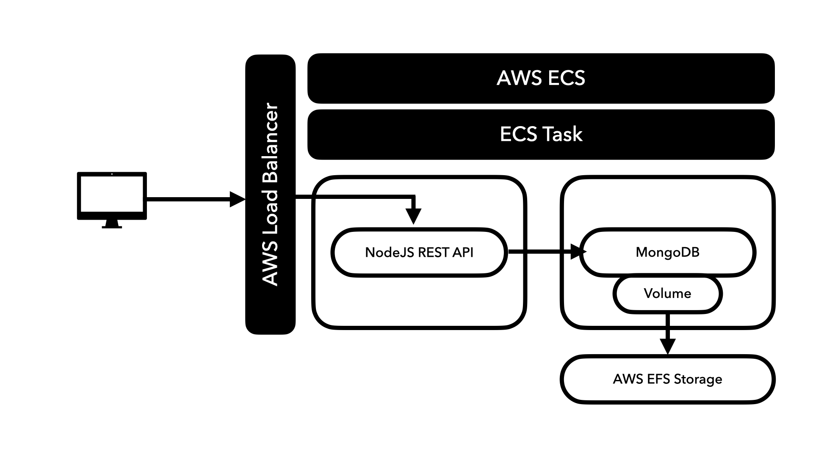
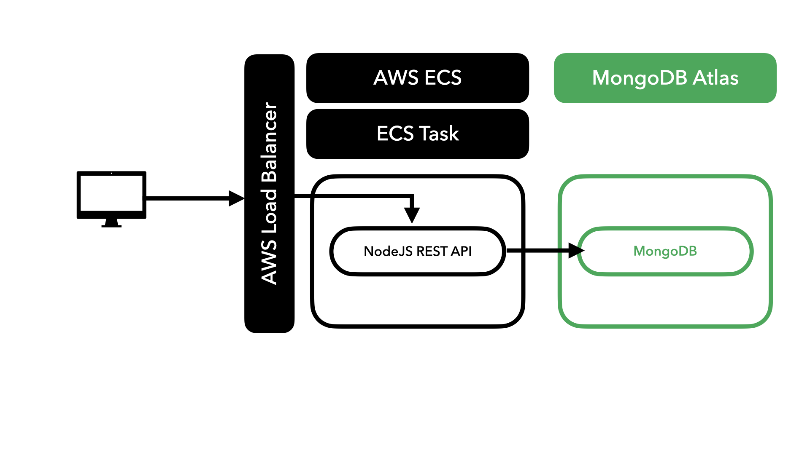
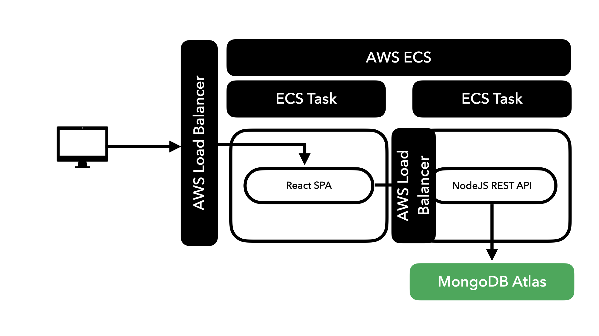

# 새롭게 알게 된 점

## 다중 컨테이너 앱 준비하기

- docker compose는 동일한 머신에서 다중 컨테이너를 관리하고 실행하는데 중요하다
- 그러나 여러 대의 머신이 함께 작동할 클라우드로 이동하면 한계가 발생한다
- ECS로는 컨테이너 IP를 자동 찾기로 사용할 수 없다

  - 이유: 로컬 머신에서 도커를 로컬로 실행하면 모든 것이 한 컴퓨터에서 발생한다. 그러나 AWS ECS에 배포하면 컨테이너와 각각의 인스턴스는 ECS에 의해 관리되고, 항상 동일한 머신에서 동작하는 것이 아니게 된다. 여러 머신과 서버가 있는 데이터 센터에서 동작된다.
  - 해결 방법: 동일한 태스크에 컨테이너를 추가하면 동일한 머신에서의 실행이 보장된다! → [localhost](http://localhost) 사용한다
  - app.js의 mongo → ${process.env.MONGODB_URL}
  - backend.env의 MONGODB_URL=mongo
    > 🧑‍💻 이러면 이전이랑 똑같지 않나…?

```bash
docker build -t goals-node ./backend/
docker tag goals-node blcklamb/goals-node
docker push blcklamb/goals-node
```

- docker hub에서 직접 레포지토리 안 만들고 바로 push 가능

> 🧑‍💻 ECS에서는 —platform linux/amd64 안해도 되는지 한 번 보자

## NodeJS 백엔드 컨테이너 구성

- 태스크 정의 -> goals-node의 Docker 명령: 'node,app.js'

## MongoDB 컨테이너, 로드 밸런서 구성

### mongodb 컨테이너 배포

- AWS ECS는 지정한 이미지 이름을 Docker hub에서 자동으로 찾는다
- [ ] Image: mongo
- [ ] port mapping: 27017
- [ ] Environment variable
  - MONGO_INITDB_ROOT_USERNAME: max
  - MONGO_INITDB_ROOT_PASSWORD: secret
- [ ] Storage, volume 나중에 할 것

### Service 생성

- [ ] Launch type: FARGATE
- [ ] Task Definition: goals
- [ ] Service Name: goals-service
- [ ] Number of tasks: 1
- [ ] Cluster VPC: cluster 생성할 때 생성된 것 선택
- [ ] Subnet: 선택할 수 있는 두 서브넷 모두 추가
- [ ] Auto-assign public IP: enabled
- Load balancing
  - [ ] Application Load Balancer
  - EC2 Console
    - [ ] Name: esc-lb
    - [ ] load balancer port: 80
    - [ ] Availablity Zones: 서비스 생성에서 선택한 VPC
  - Configure Security Settings
    - 현재는 사용하지 않지만 HTTPS 사용하도록 설정 가능
  - Configure Security Groups
    - [ ] Select an existing security group
    - [ ] Add ‘goals’ security group
  - Configure Routing
    - [ ] target group: tg
      - [ ] health check path: /goals
        - 요청이 성공 코드로 응답할 서비스의 엔드포인트로 전송되도록 하기 위한 설정
    - [ ] target type: IP
  - Register Targets
    - AWS ECS는 실행 중인 컨테이너 자동 등록한다

## ECS로 EFS 볼륨 사용하기

- [ ] 실습을 위한 가정: 코드 변경 (이미지 재빌드, 파시)
  - [ ] Service 새로 배포 - Update Service
- 재빌드되면 데이터 손실 발생
  - 컨테이너가 중지되면 데이터가 손실되기 때문
  - ECS에서도 로컬의 볼륨 처리를 해야한다
- [ ] Create new revision
  - [ ] Add Volume - name: data
  - [ ] Volume type: EFS(Elastic File System)
    - 서버에서 덜 실행되는 컨테이너에 파일 시스템을 연결하는 것을 가능하게 하는 유형
    - AWS EFS Console
      - Create file system - name: db-storage
      - Select Virtual Private Cloud: 이전 ECS 설정 시 사용한 것과 동일한 것으로
      - Customize
        - Network access
          - 두 타겟을 마운트해야하지만, 만약 VPC의 서브넷을 추가하려면 Security Groups에서 변경할 것이 있다
            - EC2 Console
              - Create Security group - name: efs-sc
              - VPC: EFS, ECS에서 사용하는 것 추가
              - Inbound rule - Type: NFS, Source: 컨테이너 관리에 사용하는 목표 보안 그룹 선택
                → Security Group, Inbound rule 없이 ECS의 컨테이너와 task는 EFS와 통신 불가
            - Security Group: 방금 만든 새 보안 그룹 선택
    - File System Id: db-storage
    - 다중 볼륨, 컨테이너로 작업 중이라면 access point ID로 관리 가능
      - 다른 볼륨에 대한 단일 파일 시스템 상에서 다른 중첩 폴더를 가질 수 있다
- 컨테이너에 볼륨 연결하기
  - [ ] mongodb 컨테이너 config
    - Storage and logging
      - [ ] Mount points: 추가한 data 볼륨 선택
      - [ ] Container Path: ‘/data/db’
- 이 task의 개정판 생성하기

  - Actions > Update Service 서비스 강제 재배포
  - [ ] platform verstion: 1.4.0, (최신 버전이 아님)
    - 만약 최신으로 했을 때 실패하면 1.4.0으로 배포(EFS 볼륨을 지원하지 않는 버전이란 의미)

- [ ] 강제 재배포 했을 때 데이터가 손실되지 않는 것을 확인하면 성공한 것임

- Task Error (Unable to lock the lock file)
  - 원인: 롤링 배포
    - 이전 태스크가 계속 실행되는 동안 새 태스크가 시작되는 중, 재배포가 일어날 때 하나의 동일한 파일 시스템과 상호 작용하려고 함, 두 DB가 같은 폴더에 있는 같은 파일에 동시에 쓰려고 하기 때문에 에러 발생
  - 해결 방법
    - mongodb 컨테이너를 다른 솔루션으로 대체
    - 또는 현재 실행 중인 태스크를 수동으로 중지하여 제거



## 프로덕션에서 DB를 사용하는 경우 궁극적으로 해결해야 할 것들

- 현재 상황: 데이터베이스 컨테이너 직접 관리
- 발생할 수 있는 문제:
  - 확장, 관리 효용성이 어려워 진다
  - 트래픽 급증 시 성능 문제 발생 가능
  - 백업과 보안에 신경 써야함

→ 관리형 데이터베이스로 가져올 것을 고려해야함

ex. AWS RDS, MongoDB Atlas

## MongoDB Atlas 사용하기

- Create Starter Cluster
  - Cloud Provider & Region: AWS
  - Cluster Tier: M0 Sandbox
- Connect to Cluster

  - Add connection string into application code

- 만약 production - development 의 DB를 다르게 가져갈 경우 주의해야할 점

  - mongoDB 버전을 동일하게 유지한다

- 동일하게 가져갈 경우 환경 변수 checklist

  - [ ] Dockerfile
  - [ ] backend.env
  - [ ] docker-compose에서 mongo 컨테이너, volume, mongo depends on 제거
  - [ ] MONGODB_URL 도 mongo atlas 연결 문자열로 대체

- connection error
  - mongo atlas > network access
    - Add IP Access List Entry: 현재 IP 주소 혹은 모든 곳에서의 접근 허용
- 만약 사용자 관리를 한다면
  - backend.env에서 MONGO_USERNAME, MONGO_PASSWORD 변경
- [ ] docker image 재배포 후 푸시

## AWS에서 mongo 컨테이너 삭제

- Task 정의에서 Create new revision
  - [ ] Container Definitions의 목록에서 제거
  - [ ] node container 환경 변수 변경
    - MONGODB_PASSWORD
    - MONGODB_URL
    - MONGODB_USERNAME
    - MONGODB_NAME: goals (not goals-dev 개발-프로덕션 환경을 구별하기 위함)
- [ ] EFS 파일 시스템 삭제
- [ ] EFS 전용 Security Group 삭제
- Update Service
  - [ ] EFS 볼륨과 관련된 것들 제거



## React 컨테이너 배포 시 문제가 되는 지점

- React의 경우 프로덕션에서 서버를 실행시키지 않아 nodeJS처럼 바로 배포되지 않는다
  `npm start` 는 실행 중인 서버를 제공하지만 프로덕션에는 적합하지 않는다
- 따라서 프로덕션 단계에서는 빌드가 필요하고, `npm run build` 는 코드 컴파일 및 최적화를 수행하고 변환 및 최적화된 파일을 내보내는 역할을 한다. 여기서 웹 서버를 추가하여 서비스를 제공할 수 있다

## 빌드 전용 컨테이너 만들기

- `Dockerfile.prod`

```docker
FROM node:14-alpine

WORKDIR /app

COPY package.json

RUN npm install

COPY . .

CMD ["npm", "run", "build"]
```

## 멀티 스테이지 빌드

- `Dockerfile.prod`

```docker
FROM node:14-alpine as custom-build

WORKDIR /app

COPY package.json

RUN npm install

COPY . .

RUN npm run build

# 모든 FROM 명령은 새 스테이지를 만든다.
FROM nginx:stable-alpine

# /app/build를 /usr/share/nginx/html에 복사한다
COPY --from=custom-build /app/build /usr/share/nginx/html

EXPOSE 80

CMD ["nginx", "-g", "daemon off;"]
```

- [nginx 설정에 대한 참고: nginx - Official Image | Docker Hub](https://hub.docker.com/_/nginx)

- ReactJS에서 실행되는 코드는 브라우저에서 실행되는 코드에 해당된다. `localhost`는 태스크나 컨테이너 또는 ECS 관리형 서버가 아닌 로컬 머신을 참조하기 때문에 `localhost`로 API를 호출하는 것은 옳지 않다.
- API_URL은 배포하는 방법에 따라서 정하는 방식이 달라진다

  - 현재는 node REST API로 동일한 태스크에 이를 배포한다. 이는 궁극적으로 동일한 URL을 통해 연결할 수 있음을 의미한다.
  - `http://localhost/goals/` → `/goals/`
  - 다른 서버에서 이를 호스팅하려 한다면 여기에 그 서버의 실제 도메인을 기입하면 된다

- 이미지 빌드 및 docker-hub 푸시

```bash
docker build -f frontend/Dockerfile.prod -t blcklamb/goals-react ./frontend
docker push blcklamb/goals-react
```

## 스탠드얼론 프론트엔드 앱 배포하기

- Add Container
  - [ ] container name: goals-frontend
  - STARTUP DEPENDENCY ORDERING
    - [ ] container name: goals-backend
    - [ ] condition: SUCCESS
- 동일한 태스크에서 같은 포트 80을 바라보고 있는 것을 불가능하므로 현재 백엔드 컨테이너, 프론트엔드 컨테이너의 포트를 수정해야한다
- 동일한 호스트에서 두 개 이상의 웹 서버를 가질 수 없다
  - 현재 Node 백엔드는 포트 80에서 수신 대기하는 자체 웹 서버를 가동한다 + nginx 프론트엔드도 마찬가지다
  - → ECS에 새로운 태스크 정의를 만든다
    - Create new Task Definition
      - [ ] Task Definition Name: goals-react
      - [ ] Requires Compatibilities: FARGATE
      - [ ] Task Role: ecsTaskExecutionRole(백엔드에 사용한 것과 동일한 태스크 역할 사용)
      - Task Size에 최소한의 CPU와 메모리 할당
      - Add Container
        - [ ] container-name: goals/react
        - [ ] images: blcklamb/goals-react
        - [ ] port mapping: 80
- 서로 다른 태스크에서 프론트엔드, 백엔드가 작동하므로 API_URL을 변경해야한다
  ```jsx
  const backendUrl = process.env.NODE_ENV === 'development' ? 'http://localhost': `${backend loadbalancer DNS name}`
  ```
  > 👩‍💻 해당 URL은 왜 환경 변수로 관리하지 않지?
- 브라우저에서 프론트엔드 애플리케이션으로 접속하기 위한 DNS 생성

  - Application Load Balancer
    - [ ] name: `goal-react-lb`
    - AZ
      - [ ] VPC: 다른 로드 밸런서와 동일한 VPC
      - (해당 보안 그룹은 들어오는 트래픽에 대해 포트80을 연다)
    - Target Group
      - [ ] name: `react-tg`
      - [ ] target type: IP
    - health checks
      - [ ] path: /
  - 로드밸런서 설정으로 가서 DNS name을 찾는다.

- 코드 변경 후 재빌드, 푸시

```bash
docker build -f frontend/Dockerfile.prod -t blcklamb/goals-react ./frontend
docker push blcklamb/goals-react
```

- Create Service
  - [ ] Launch type: FARGATE
  - [ ] cluster: `goals-app`
  - [ ] service name: `goals-react`
  - [ ] number of tasks: 1
  - [ ] deployment type: rolling update
  - subnets
    - [ ] 클러스터가 제공하는 이 VPC에 두 개의 서브넷을 추가
  - configure security groups
    - [ ] 기존 보안 그룹 사용
    - 이미 포트 80을 노출하고 있음
  - [ ] auto-assign public IP: ENABLED
  - [ ] load balancer name: `goals-react`
    - [ ] target group name: `react-tg`



## 원하는 스테이지만 빌드하기

```bash
docker build --target build(as로 명시한 state 이름) -f frontend/Dockerfile.prod ./frontend
```
