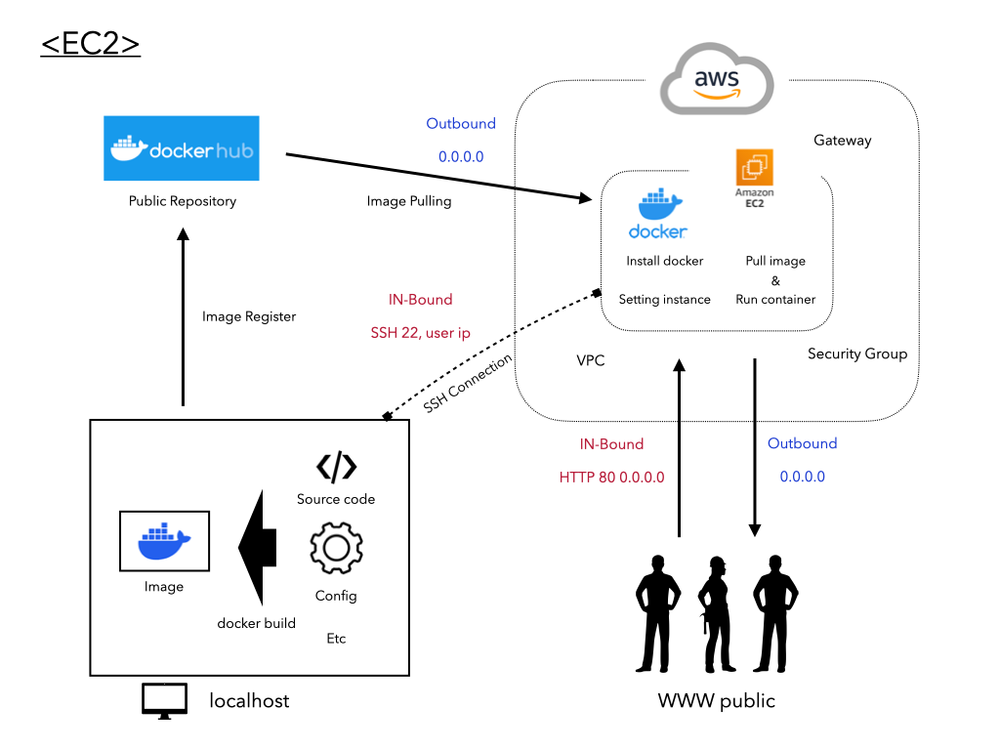
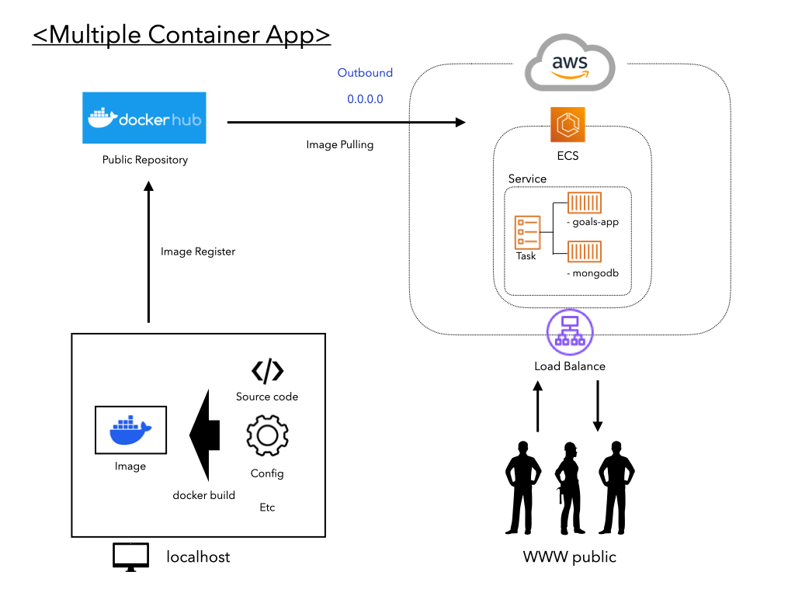
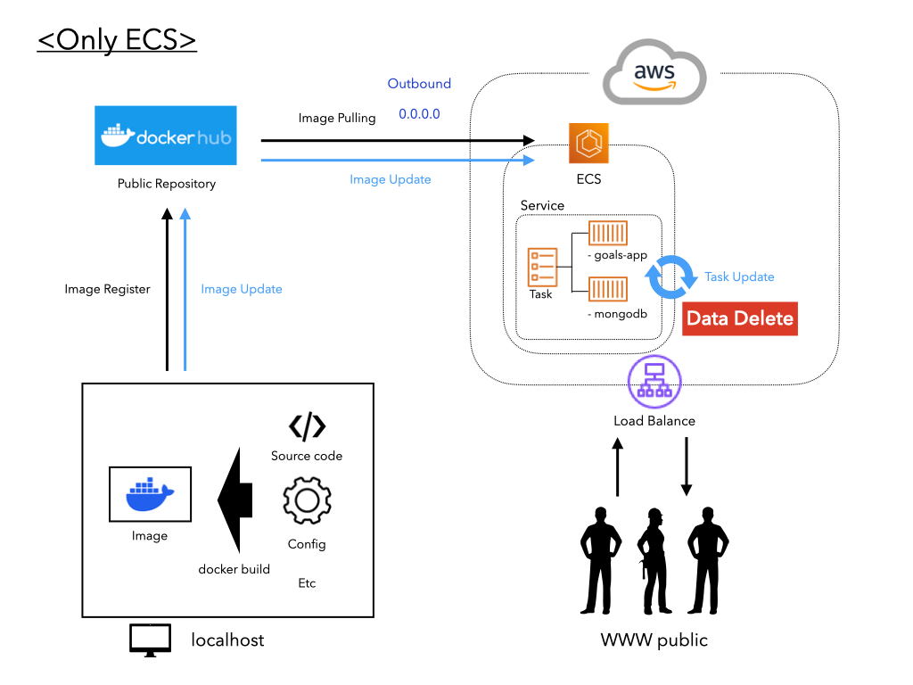
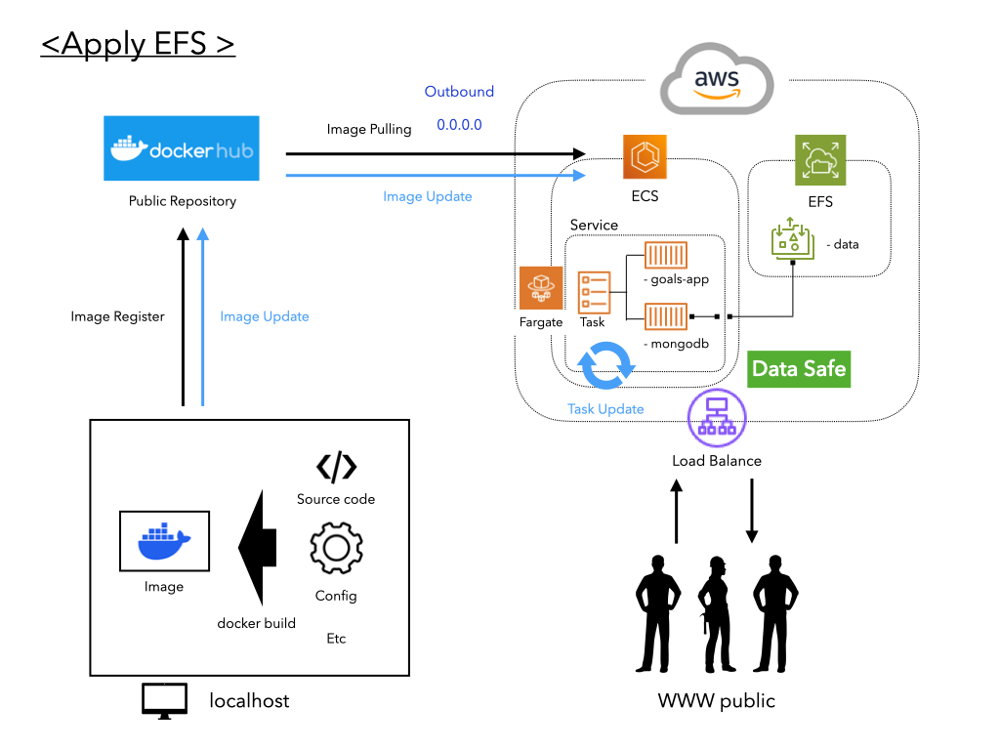
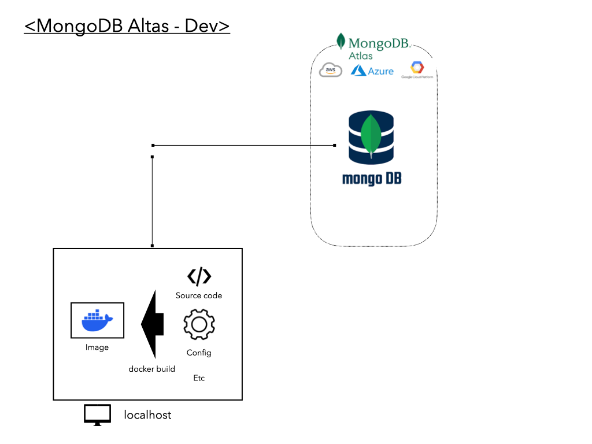
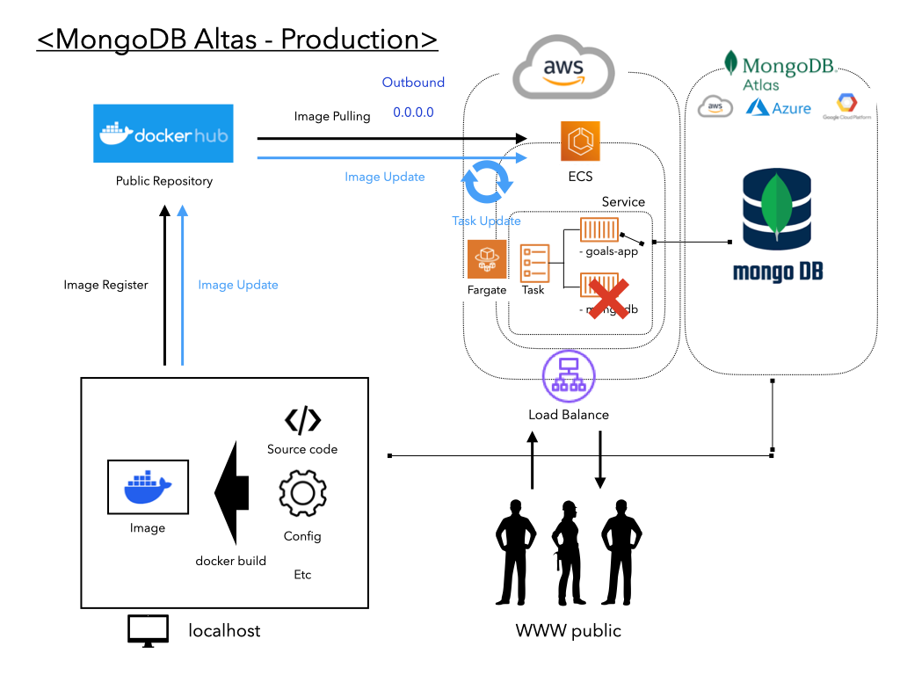
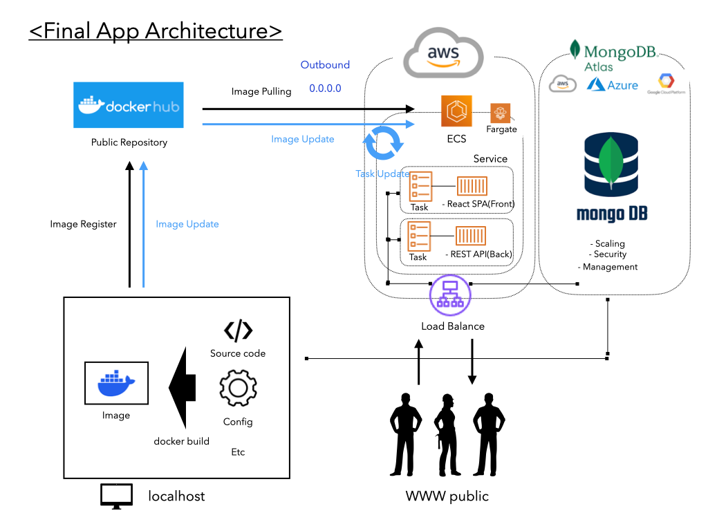

# 새롭게 알게된 점

- 다중 컨테이너 앱 배포하기 
- EFS 볼륨
- 멀티 스테이징


## 기존 EC2 방식




## 다중 컨테이너 앱

- 배포시에 /로컬에서 사용할 수 있던 /도커내에서 사용되던 도메인 이름을 더이상 사용할 수 없음. == 같은 네트워크내에 묶을수가 없음 Ip = mongodb




- aws ecs의 경우 동일한 태스크에 컨테이너를 추가하면, 동일한 머신에서의 실행이 보장됨. 

- 그래도 여전히 aws ecs는 도커 네트워크를 생성하지 않고 그 대신, localhost를 컨테이너 애플리케이션 코드 내부의 주소로 사용할 수 있게 해줌. 


- 로드 밸런스를 추가하여 도메인을 고정할 수 있음. 


## ECS로 EFS 볼륨 사용하기 


1. 소스코드 변경 후 도커허브에 이미지 업데이트 

2. 최신 변경사항 배포 

3. Ecs 태스크-서비스 업데이트




문제점 

- ecs 태스크가 업데이트 되면서 같은 태스크에 속한 DB 컨테이너에 저장된 데이터가 사라졌음. 

- 영속성을 보장할 수 없음. 


해결책

- **데이터의 영속성**을 보장하기 위해서 로컬에서 했던 것처럼 **일종의 볼륨**을 설정해주어야 함.

- aws ecs 태스크에서 **volume**을 지정해 줄 수 있음. 
  - **볼륨 타입 - EFS**
  - 서버리스 컨테이너에 파일 시스템을 연결하는 것을 지원해줌 
  - 도커의 네임드 볼륨 역활을 대신해준다


**EFS란?**

```
AWS 클라우드 서비스와 온프레미스 리소스에서 사용할 수 있는 간단하고 확장 가능하며 탄력적인 파일 스토리지를 제공하는 서비스 이다. EFS는 리눅스 인스턴스를 위한 확장성, 공유성 높은 파일 스토리지로, EC2 Linux 인스턴스에 마운트된 Network File System(NFS)을 통해 VPC에서 필요한 파일에 접근하거나 AWS Direct Connect로 연결된 온프레미스 서버의 파일에 접근할 수 있다. 쉽게 생각해서 EFS는 회사의 온프레미스 환경의 NFS, NAS 폴더와 비슷한 서비스라고 이해하면 된다.
그래서 수천대의 EC2 인스턴스간 파일 시스템 공유 가능하며, 병렬 접근이 가능하도록 설계되어 있어, 두 개 이상의 EC2로부터 하나의 공유된 스토리지 공간이 필요할 때 EFS를 채택하면 된다.
```

출처: https://inpa.tistory.com/entry/AWS-📚-EFS-개념-원리-사용-세팅-💯-정리 [Inpa Dev 👨‍💻:티스토리]



해결과정

- EFS 서비스 페이지로 이동하여 파일 시스템 생성 
  - 새 보안그룹 설정
  - 인바운드 규칙을 NFS(network file system, 2049)와  ecs태스크에서 사용하던 보안 그룹을 선택하여 사용
  - 보안그룹과 인바운드 규칙없이는 ecs 컨테이너와 태스크가 <---> EFS와 통신 불가능
- Ecs 태스크 생성에서 볼륨 지정으로 다시 돌아와 방금 생성한 EFS 볼륨을 지정
- Ecs 태스크안의 DB 컨테이너의 스토리지 마운트 포인트를 EFS 볼륨과 연결시킴 
  - Mount Points . `EFS:/data/db`
- 위 설정으로 새로운 태스크 정의
- 새로운 태스크로 서비스 업데이트


> 이제 새로운 컨테이너를 배포하더라도 EFS볼륨을 유지하는 한 기존 데이터의 영속성을 보장할 수 있음.


서비스 업데이트 과정에서 현재 실행중인 태스크, 배포하려는 태스크가 동시에 떠있게 되는 과정에서 DB 동시 접근 문제가 발생

- Mongodb 서비스를 추후 다른 솔루션으로 교체 

- 수동으로 중지 및 제거 후 배포 태스크 런칭


## 데이터 베이스 고려사항


- 가용성 확장과 관리의 잠재적 어려움 
  - 가용성 : 서버와 네트워크 또는 프로그램 등의 다양한 정보 시스템이 정상적으로 사용 가능한 정도
- 트래픽 급증시 성능 문제 발생
- 데이터 백업과 보안 문제

AWS의 데이터베이스 솔루션을 사용하는 것을 고려


## MongoDB Altas 사용하기


개발 DB와 프로덕션 DB 스테이징을 나눔


### 개발 단계에서의 DB 연결




- 로컬에서 mongoDB Altas에 연결하기


### 프로덕션 단계에서의 DB 연결




이미지 변경

- 도커 이미지 재빌드 
- 도커 허브 배포 


AWS에서 변경

- 기존 태스크에서 몽고 컨테이너 삭제 
- Efs 삭제 
- Efs 용 보안 그룹 삭제 

- 기존 태스크 - 백엔드 컨테이너의 DB 설정을 mongoDB Altas 설정으로 변경
  - MONGODB_USERNAME -> MongoDB Altas (기존 mongodb container)
  - MONGODB_PASSWORD -> MongoDB Altas (기존 mongodb container)
  - MONGODB_URL -> MongoDB Altas (기존 mongodb container)
  - MONGODB_NAME -> MongoDB Altas DB NAME
- 서비스 업데이트 - 재배포


## 최종 아키텍쳐 & 스테이징 개념 도입




⚠️<u>153 일반적인 문제 이해하기 부분에서</u>

- **<u>React 빌드 과정이 익숙하지 않아 잘 이해가지 않음..</u>** 
- 리액트 내부에 개발용 미니 서버를 가지고 있다고 생각하면 될까 ?
- Django에 개발용 웹서버를 탑재하고 있듯이? 
- 리액트도 실행을 위한 일종의 바이트 코드로 바꿔주는 빌드 과정이 필요?
- 개인 생각 : react의 작동방식이 클라이언트 사이드 렌더링으로 개발시에 브라우저 역할을 해주는 노드 엔진을 사용하다가 배포시에는 브라우저가 역할을 대신 함으로 개발용 노드 엔진을 제거하는 과정이 빌드 과정이 아닐까 ? (확인 필요)


**멀티 스테이징 개념**

- 개발 설정과 배포 설정의 분리 
  - 다르게 실행되어야 할 필요가 있는 경우
- 빌드 과정이 필요한 경우 
  - Ex) 리액트의 경우 개발에 유용한 개발 서버 단계가 있으며 
  - build 과정을 통해 production에서만 적합한 코드만 추출 (No server)

```dockerfile
# react build stage
FROM node:14-alpine as build
WORKDIR /app
COPY package.json .
RUN npm install
COPY . .
RUN npm run build

# nginx stage(using react build stage)
FROM nginx:stable-alpine
COPY --from=build /app/build /usr/share/nginx/html
EXPOSE 80
CMD ["nginx", "-g", "deamon off;"]

```

- FROM 명령어를 사용하여 새 스테이지를 만들고 이전 명령 내용을 새 베이스 이미지로 전환 시킬 수 있다. 

- FROM 절에 as를 사용하여 별칭 지정이 가능하다. 
- `COPY --from=[build:alias]` 빌드 스테이지에서 최종 컨텐츠를 복사
- `COPY --from=build /app/build /usr/share/nginx/html` 해석
  - 앞전에 build 스테이지에서 사용된 컨테츠를 사용할 건데 
  - Build 스테이지 : 컨텐츠의 `/app/build` 에 저장된 컨텐츠를 
  - 이번 스테이지(nginx)의 `/usr/share/nginx/html` 에 복사하겠다.

**<u>동일한 Dockerfile 에서 2이상의 스테이지를 가질 수 있다.</u>**

- `--target` 옵션으로 원하는 스테이지만 빌드도 가능하다
  - `docker build --target build -f frontend/Dockfile.prod ./frontend`