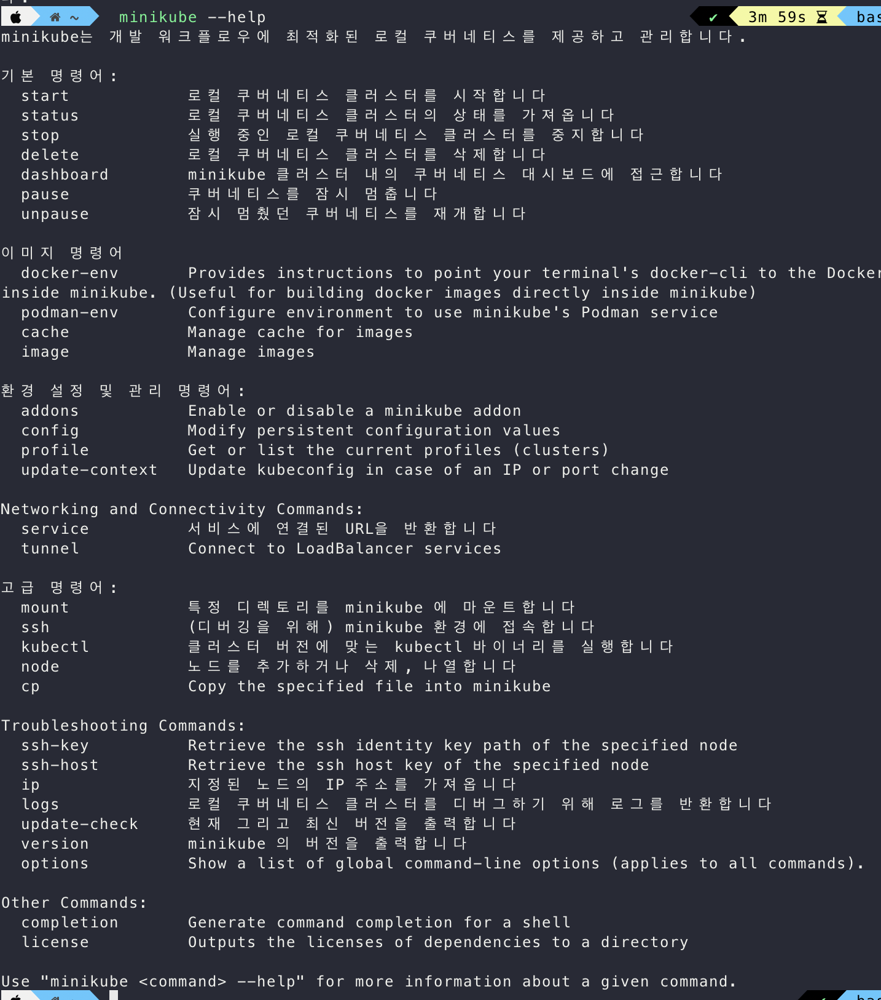
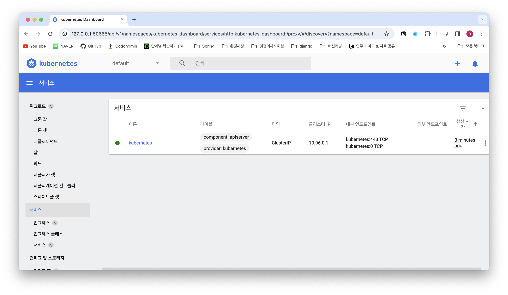
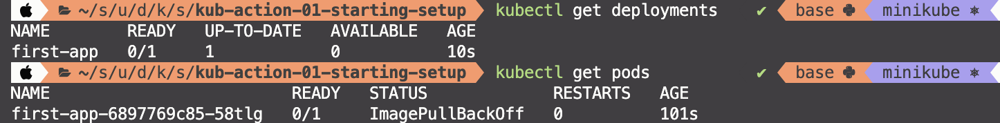
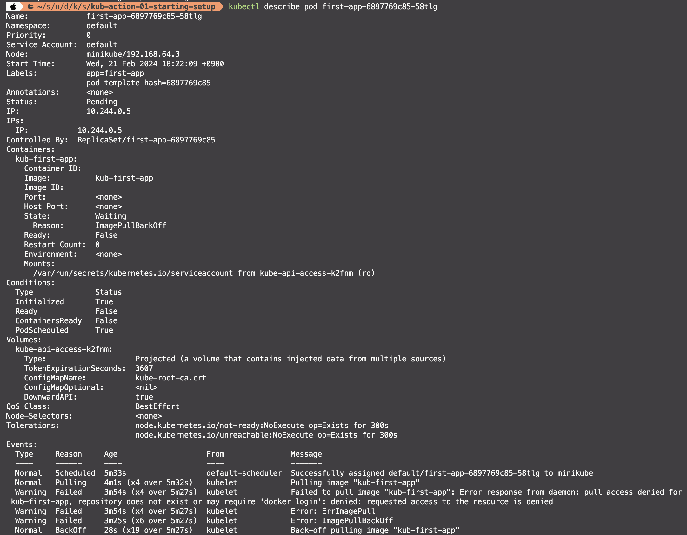
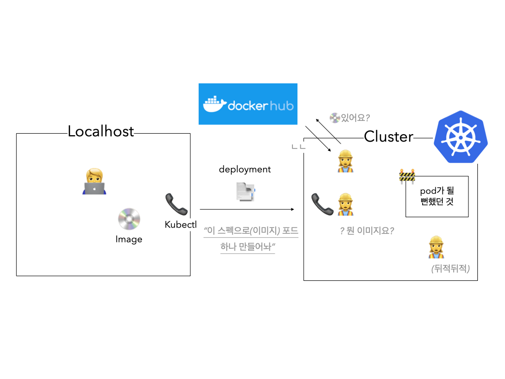
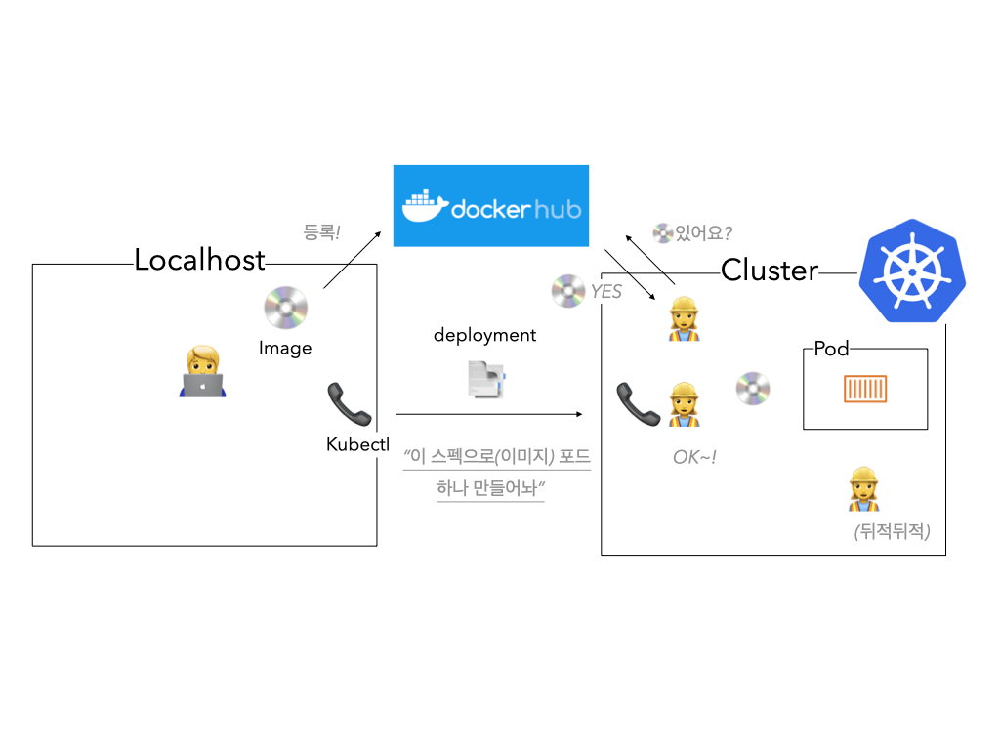
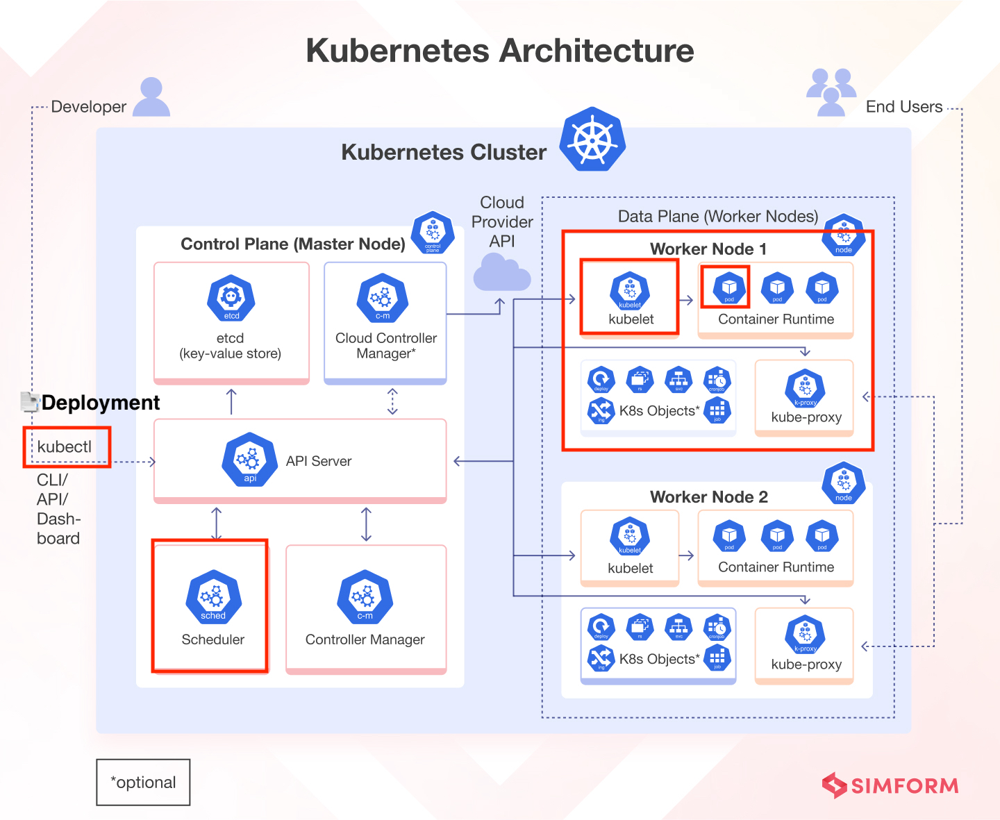
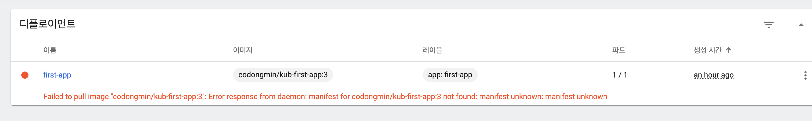
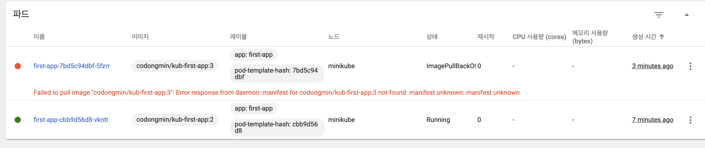

# 새롭게 알게된 점

- Kubernetes(minikube, kubectl) 설치 및 작동 원리
- Kubernetes 객체 이해 


이전 회차 종진님이 올려주신 아키텍쳐 그림, 공홈보다 더 직관적이어서 보면서 강의를 들어봄


## Kubernetes 요구사항, 

- 클러스터는 기술적인 인프라 일종의 머신들, 마스터 노드 + 워커 노드

- kubectl 도구는 해당 클러스터(인프라)와 통신하고 이 쿠버네티스 설정과 통신하기 위한 통신 장치.

 

- <u>**Minikub를 사용**</u>

  - 쿠버네티스를 배우고 테스트하기 위해 로컬에 설치하는 도구  

  > minikube is local Kubernetes, focusing on making it easy to learn and develop for Kubernetes.

  > All you need is Docker (or similarly compatible) container or a Virtual Machine environment, and Kubernetes is a single command away: `minikube start` 

  - 로컬 머신에 가상 머신을 이용하여 더미 클러스터를 생성 
    - 가상머신이 더미 클러스터를 가지는 형태 
    - 실제로는 단일 노드 클러스터를 생성 = 워커, 마스터 동일


MAC OS의 경우 brew 설치 가능 (https://minikube.sigs.k8s.io/docs/start/)
영상에 나오는 별도의 Hypervisor 설치는 안내가 따로 없어 스킵


- default가 hyperkit 로 설정되는 듯.. console 귀엽게 잘해놨네
- 이후 VM 이미지 다우ㄴ받고, 쿠버네티스, 다운로드 및 설치 시작
- 




- Minikube-dashboard 도 제공.. 이쁘네..

  


- <u>**Kubectl 설치** (Kubernetes command-line tool)</u>
  - Minikub와 kubectl은 별개! 
  - minikub는 일종의 클러스터를 시뮬레이션 하는 것이고, 이 시뮬레이션한 클러스터와 통신하는 도구인 kubectl은 이와 별개다. 

MAC OS의 경우 brew 설치 가능 


## Kubernetes 객체 이해하기

- Pods, Deployments, Services, Volume 등 쿠버네티스와 동작하기 위한 객체들이 있으며, 
- 이를 생성할 수 있음. 그리고 이러한 객체들에 인코딩된 명령을 기반으로 객체만의 행위를 수행함.(+쿠버네티스와) 

- 객체를 생성하는 방법에는 2가지가 있음
  - 명령적 방식(Declaratively)과
  - 선언적 방식(Imperatively)


### Pod 객체

- 쿠버네티스와 상호작용하는 가장 작은 유닛
- 하나 또는 여러개의 컨테이너를 포함하고, 실행할 수 있다.
  - 일반적으로는 포드 하나당 컨테이너 하나
  - You would tell Kubernetes to do that, by creating a pod object in code or with help of a command, and sending that object to Kubernetes. 

- 컨테이너들과 공유할 수 있는 볼륨과 같은 공유 리소스를 보유한다. 
  - 같은 pod 내부겠지? 
- Pod는 다른 Pod나 외부와 통신할 수 있다. 
  - 기본으로 Pod에는 클러스터 내부용 IP 주소를 가짐.
  - 만일, 하나의 포드안에 여러 컨테이너가 있다면, 해당 컨테이너들끼리는 localhost를 사용해 통신함.
- AWS ECS 서비스의 task가 Pod 객체의 개념과 매우 비슷함.


#### Pod는 임시적이다

- 쿠버네티스에 의해 생성되고, 정지되고, 교체되면, pod의 모든 리소스(컨테이너의 데이터 등)는 보관되지 않음.
- 이는 의도된 디자인 설계, 컨테이너의 핵심 아이디어와 비슷하다.


> Pod는 일종의 컨테이너를 위한  Wrapper 객체(컨테이너=같은 타입의 여러 *객체*를 저장하는 일종의 집합)같다. 


우리가 클러스터안에(특정 워커에서:머신에서) Pod를 직접 생성,관리하는 개념이 아닌! Pod의 생명주기를 관리할 컨트롤러에게 이를 위임하는 개념

그리고 그러한 컨트롤러 역할에 속하는 객체가 Deployment이다. 


## Deployment 객체

- 생성하고 관리해야 하는 pod의 수와 컨테이너의 수에 대한 지침서 객체 

- Deployment 객체는 하나 이상의 pod를 제어할 수 있다. 

  - So, you can also use it to create multiple Pods at once

    and the core philosophy behind this Deployment object,

    which under the hood is a controller object.

- 원하는 목표 상태(target state-포드,컨테이너를 실행할 인스턴스 수 등) 설정한다는 것이 핵심 컨셉 

  - 쿠버네티스는 목표상태로 현재 상태(actual state)를 맞춘다.

- Deployment 객체를 일시중지하고, 삭제하고, 롤백할 수도 있다.

- Deployment 객체도 다이나믹하게 스케일링할 수 있다.

  - 특정 메트릭(수신 트래픽, CPU사용률 등)을 설정할 수 있는 오토 스케일링 기능을 사용할 수도 있음.
  - 오토스케일링 기준을 설정할 수 있음. 

- 여러 개의 deployment 객체도 가능.


> 결론적으로 Pod를 직접적으로 컨트롤할 일이 없다. Deployment 객체로 우리가 원하는 바를 지시할 수 있다. 일종의 작업지시서! 


## Deployment 생성

- 쿠버네티스를 사용하더라도 도커를 사용하지 않는 것은 아님. 
- 주의해야할 점은 쿠버네티스에서 사용하기 위한 개념은 컨테이너!
- 때문에 직접적으로 컨테이너를 만들지는 않더라고 이를 사용하기 위한 이미지를 위해 도커가 필요함. 
  - 도커는 그냥 일종의 컨테이너 기술을 사용하기 위한 도구. 도커 말고도 많다. 그 중 도커가 유명할 뿐


1. 이미지 생성(도커)
2.  이미지를 보내거나, 클러스터에 Deployment를 생성하라는 지시를 보낼 수 있음
   - kubctl 을 통해 deployment를 생성 (명령적 접근 방식)
   - `kubectl create deployment [deployment name] --image=[image name]` 로 deployment 객체를 자동으로 쿠버네티스 클러스터로 전송
   - `kubectl get deployments` 로 현재 deployment 를 확인할 수 있음. 
   - 
   - 여기서 READY는 (Current State / Target State)임. 위의 이미지는 deployment, pod 둘다 원하는 목표상태가 아님, 이미지의 status의 경우 imagePullBackOff라는 에러 상태 임을 알 수 있는데

`kubectl describe pod [pod id]` 로 상세를 확인할 수 있음. 



- 맨 하단에 Events에서 해당 오류를 확인할 수 있는데 "kub-first-app" 이미지를 풀링하려는데, 해당 레포에 접근할 수 없어서, 이미지 풀링에 실패한 것을 알 수 있다. 
- 현재의 로컬 머신과 클러스터는 분리된 머신이라고 생각해야 한다. 따라서 클러스터에서 아무리 이미지를 뒤지려고 해도 빌드한 이미지는 나의 로컬 머신에만 존재하기 때문에 찾지 못하는 것이 당연하다. 

정리하면 다음과 같은 상태






## Kubectl 작동 배경




**해당 명령어를 실행하게 되면 내부에서는 다음과 같은 일들이 벌어진다.**

`kubectl create deployment --image ...`

- Deployment객체를 생성한 후 
  - Master Node(Control Plane)에 Deployment객체를 전달한다. 
- Master Node는 클러스터에 필요한 것을 생성하는데, 
- 스케쥴러가 현재 실행중인 포드들을 분석하고 Depolyment로 만들어질 포드에 가장 적합한 노드를 찾는다. 
- 그리고 새로 생성된 포드는 해당 노드에 전달되게 된다.
- 포드를 전달받은 노드에서는 kublet 서비스를 얻을 수 있다. 
  - kublet 서비스는 포드를 관리하고, 포드에서 컨테이너를 실행, 포드 모니터링하고 상태 확인함. 
  - 그리고 포드에서 실행되는 컨테이너는 Deployment 객체에서 지정된 이미지를 사용하여 빌드된다. 


## Service 객체 

- Pod와 Pod에서 실행되는 컨테이너에 접근하려면 서비스 객체가 필요함. 
- 서비스는 클러스터의 다른 pod에 pod를 노출한다.  
- pod에는 기본으로 클러스터 내부의 IP 주소가 있다고 했음.
  - 이는 다음과 같은 상황에서 문제가 되는데
    1. 클러스터 외부에서 pod에 엑세스 하는데 사용할 수 없음.
    2. 포드가 교체될때마다 주소가 변경됨.
  - 때문에 내부 IP를 pod와 통신하기 위한 방법으로는 적합하지 않음. 

- 서비스는 포드들을 그룹화하고, 공유 주소, 공유 IP 주소를 제공함. 
  - 이때 IP는 포드의 내부 IP처럼 변경되지 않음 static함
- 클러스터 내부는 물론 외부에서도 저정 IP 주소를 노출하도록 지시할 수 있음. 
  - 그로 인해 클러스터 외부에서 pod에 접근할 수 있게 됨. 


> 서비스가 없이 포드와 연결하는 것은 까다롭다. 클러스터 외부에서 서비스 없이는 포드에 접근할 수 없다.


## Service로 Deployment 노출 

`kubectl expose  deployment [name] --type=[type option] --port=[number]`

- Service 객체를 생성하고, deployment에 의해 생성된 pod를 노출함. 

- type은 여러 가지가 있음 
  - ClusterIP(기본) 클러스터 내부에서만
  - NodePort(워커노드의 IP를 노출)
  - LoadBalancer(IP 고정, 부하 분산) - 클러스터 인프라가 지원해야 함.

```sh
    ~  kubectl get services                                      ✔  base   minikube ⎈  19:16:56 
NAME         TYPE           CLUSTER-IP      EXTERNAL-IP   PORT(S)          AGE
first-app    LoadBalancer   10.106.170.32   <pending>     8080:30762/TCP   15s
kubernetes   ClusterIP      10.96.0.1       <none>        443/TCP          97m
```

- minikube에서는 EXTERNAL-IP pending 상태로 
- 나중에 aws 등에서는 IP를 부여받는 식으로 작동하는 듯?


minikube에서는 로컬 머신에서 접근할 수 있는 IP에 특수 포트를 매핑하여 접근할 수 있는 기능을 제공

```sh
>>> minikube service first-app
|-----------|-----------|-------------|---------------------------|
| NAMESPACE |   NAME    | TARGET PORT |            URL            |
|-----------|-----------|-------------|---------------------------|
| default   | first-app |        8080 | http://192.168.64.3:30762 |
|-----------|-----------|-------------|---------------------------|
🎉  Opening service default/first-app in default browser...
```


## 컨테이너 재시작

```sh
# 에러 발생
NAME                         READY   STATUS   RESTARTS      AGE
first-app-5fb8d5d54d-l8cc6   0/1     Error    2 (37s ago)   48m
# 재시작
NAME                         READY   STATUS             RESTARTS      AGE
first-app-5fb8d5d54d-l8cc6   0/1     CrashLoopBackOff   2 (27s ago)   48m
# 정상화
NAME                         READY   STATUS    RESTARTS      AGE
first-app-5fb8d5d54d-l8cc6   1/1     Running   3 (31s ago)   48m
```

- 쿠버네티스틑 컨테이너에 에러가 발생한 경우 자동으로 재시작해주지만 
  - 무한루프(계속 실패하는 컨테이너)를 막기 위해 점진적으로 더 오래 대기함


## 스케일링	 

` kubectl scale deployment/first-app --replicas=3`

- replicas 는 pod 인스턴스를 뜻함

```sh
# 생성 중
NAME                         READY   STATUS              RESTARTS        AGE
first-app-5fb8d5d54d-d4vw8   0/1     ContainerCreating   0               4s
first-app-5fb8d5d54d-dqnql   0/1     ContainerCreating   0               4s
first-app-5fb8d5d54d-l8cc6   1/1     Running             3 (5m19s ago)   53m

# 생성 완료
NAME                         READY   STATUS    RESTARTS        AGE
first-app-5fb8d5d54d-d4vw8   1/1     Running   0               15s
first-app-5fb8d5d54d-dqnql   1/1     Running   0               15s
first-app-5fb8d5d54d-l8cc6   1/1     Running   3 (5m30s ago)   53m
```

- deployment 숫자는 늘어날까요? 아닐까요?
- Replicas 수를 다시 줄여주면 최초 pod가 삭제될까요?


## Deployment 업데이트

- `kubectl set image deployment/[deployment name] [container name]=[image name]`
  - ``kubectl set image deployment/first-app kub-first-app=codongmin/kub-first-app`
- 소스코드의 변경이라던가, 기타 새로운 이미지를 다시 배포해야하는 경우 deployment 업데이트를 할 수 있음.
- 이때 쿠버네티스에게 현재이미지가 어떤 이미지로 업데이트 해야하는 지 알려야함. 
  - 컨테이너 이름을 옵션으로 새로운 이미지를 지정해준다.
  - 기본적으로 새로운 이미지의 경우 새로운 태그가 있는 경우 동작함.

```sh
# 이미지 적용 전
>>> kubectl set image deployment/first-app kub-first-app=codongmin/kub-first-app

# 이미지 적용 후
>>> kubectl set image deployment/first-app kub-first-app=codongmin/kub-first-app:2
deployment.apps/first-app image updated
```


- 기존 이미지를 사용하던 pod를 제거하고, 새로운 이미지를 바탕으로 하는 포드를 새로 런치함.


### Deployment 롤백 & 히스토리 

- `kubectl rollout status deployment/first-app`
- 해당 명령어는 deployment 에서 현재 진행중인 작업을 알려줌.


```sh
# 정상 실행 되었을 때
>>> kubectl rollout status deployment/first-app
deployment "first-app" successfully rolled out


>>> kubectl set image deployment/first-app kub-first-app=codongmin/kub-first-app:3
deployment.apps/first-app image updated

# 문제가 있는 경우
>>> kubectl rollout status deployment/first-app
Waiting for deployment "first-app" rollout to finish: 1 old replicas are pending termination...
```



- rolling update 전략 때문에 새포드가 성공적으로 시작되기 전까지 이전 포드를 삭제하지 않음.




이럴 경우(포드가 재시작 될 수 없는 경우) 업데이트를 롤백해야할 필요성이 있음. 

- `kubectl rollout undo deployment/[deployment name]`

```sh
>>> kubectl get pods
NAME                         READY   STATUS             RESTARTS   AGE
first-app-7bd5c94dbf-5fzrr   0/1     ImagePullBackOff   0          4m28s
first-app-cbb9d56d8-vkntt    1/1     Running            0          9m3s

>>> kubectl rollout undo deployment/first-app
deployment.apps/first-app rolled back

>>> kubectl get pods
NAME                        READY   STATUS    RESTARTS   AGE
first-app-cbb9d56d8-vkntt   1/1     Running   0          9m22s
```


더 이전 업데이트로 롤백해야 하는 경우 히스토리를 확인할 수 있음. 

- `kubectl rollout history deployment/[deployment name]`

```sh
>>> kubectl rollout history deployment/first-app

deployment.apps/first-app
REVISION  CHANGE-CAUSE
1         <none>
3         <none>
4         <none>
```

- `kubectl rollout history deployment/[deployment name] --revision=3` 으로 버전의 상세를 확인할 수 있음. 

```shell
>>> kubectl rollout history deployment/first-app --revision=3
deployment.apps/first-app with revision #3
Pod Template:
  Labels:	app=first-app
	pod-template-hash=7bd5c94dbf
  Containers:
   kub-first-app:
    Image:	codongmin/kub-first-app:3
    Port:	<none>
    Host Port:	<none>
    Environment:	<none>
    Mounts:	<none>
  Volumes:	<none>
  
  
>>> kubectl rollout history deployment/first-app --revision=1
deployment.apps/first-app with revision #1
Pod Template:
  Labels:	app=first-app
	pod-template-hash=5fb8d5d54d
  Containers:
   kub-first-app:
    Image:	codongmin/kub-first-app
    Port:	<none>
    Host Port:	<none>
    Environment:	<none>
    Mounts:	<none>
  Volumes:	<none>
```

만약 revision 1로 롤백하고 싶다면 

- `kubectl rollout undo deployment/[deployment name] --to-revision=[revision number]`

```sh
>>> kubectl rollout undo deployment/first-app --to-revision=1
deployment.apps/first-app rolled back
```


제거는 다음 명령어로 실행 

```shell
>>> kubectl delete service first-app
service "first-app" deleted

>>> kubectl delete deployment first-app
deployment.apps "first-app" deleted
```


## 명령적 접근방식 vs 선언적 접근방식

- 위의 경우에는 모두 **<u>명령적 방법</u>**으로 실행하고, 구동했음
- 이 방법은 편리하긴 하지만, 명령어를 외우고 매번 작성해야 하는 번거로움과 피로함이 존재
  - 도커에서 매번 명령어로 실행하는 것과 같은 패턴 
  - 도커에서는 docker-compose로 이러한 불편함을 해결
- 이를 매번 작성하는 것이 아닌 deployment 및 서비스 구성을 파일에 기록할 수 있다면 좋을 것
  - 쿠버네티스틑 이러한 기능을 지원함


- 구성 옵션, deployment 객체 배포방법, 컨테이너, 이미지, 원하는 포드 인스턴수 수 등을 정의할 수 있음. 
- 이런 방식을 **<u>선언적 접근 방식</u>**이라고 함. 
  - `kubectl apply -f config.yaml` 을 통해 수행할 수 있음.
  - `config.yaml`에는 원하는 목표 상태를 정의하고 쿠버네티스는 현재 상태를 목표 상태로 만들기 위해 필요한 모든 작업을 수행함.
  - `config.yaml`을 변경하고 적용하면 쿠버네티스틑 변경사항을 파악하고 실행중인 클러스터와 어플리케이션에 적절한 변경을 수행함.


## 배포 구성 파일 생성하기

- deployment를 정의하고 어떻게 작동되어야 하는지를 기재 
- 쿠버네티스 구성 파일에 사용되는 구문을 이용해야 함. 
- 배포 구성 파일의 이름은 커스텀으로 지정해도 가능함. 


```yaml
apiVersion: apps/v1
# 생성하려는 쿠버네티스의 객체 종류를 지정
# Service, Job 등 지정되어 있는 리소스 유형을 기재
kind: Deployment 
# kind에 세부 Metadata 설정
metadata: 
  name: second-app-deployment
# 배포 파일의 핵심, kind를 구성하는 방법을 정의하는 구역
spec:

```


Spec은 to be continue...


# 함께 이야기하고 싶은 점


