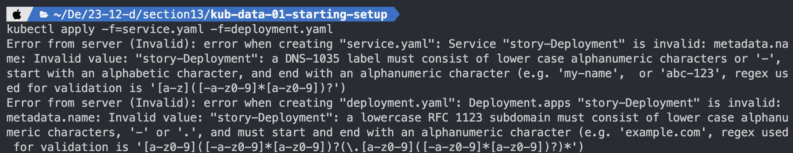
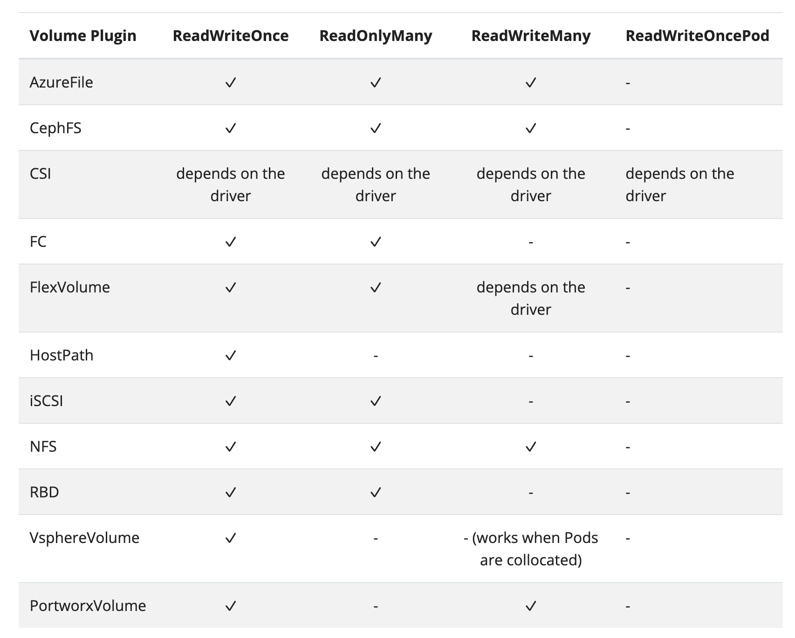
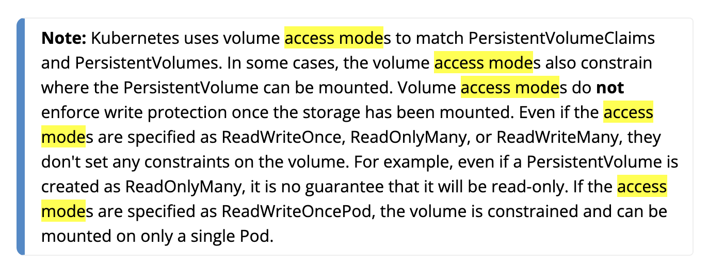
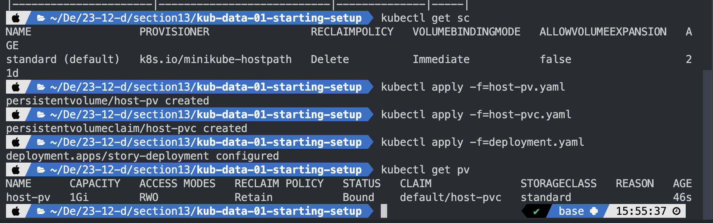

# 새롭게 알게된 점

## 핵심 주제

> ❓어떻게 데이터를 저장할 것인가
> docker에서 컨테이너가 중지, 재시작되었을 때와 마찬가지로 node의 제거, 이동, 확장 시 데이터가 살아남게 하려면 어떻게 해야할 것인가

- Volume
- Persistent Volume, Persistent Volume Claim
- Environment Variable

## ‘State’ 이해하기

- 컨테이너 제거, 중지에 따라 손실되어서는 안되는 애플리케이션 내에서 생성되는 데이터
  - 유저가 생성한 데이터
    - ex. 유저 계정, 업로드한 데이터
    - 데이터베이스 내지 파일에 저장된다
  - 앱에서 파생되어 필요한 중간 결과
    - 메모리 내지 임시 데이터베이스, 파일에 저장된다
- 우리는 `docker`, `docker-compose` 명령을 직접 내리지 않는 대신 쿠버네티스를 사용하여 클러스터, 배포 객체를 오케스트레이션한다
  - 즉 `-v` 명령어를 사용하는 것이 아니기 때문에 쿠버네티스 내의 설정이 별도로 필요하다

## 쿠버네티스와 볼륨

- 쿠버네티스는 컨테이너에 볼륨을 마운트시킬 수 있다
  - 다양한 볼륨 타입, 드라이버 지원 가능
    - local 볼륨
    - 클라우드 서비스 볼륨
- 볼륨의 수명은 Pod의 수명에 의존한다
  - 볼륨은 컨테이너 재시작, 삭제에도 살아남는다
  - 볼륨은 Pod가 삭제되면 제거된다

## 쿠버네티스 볼륨 vs 도커 볼륨

| 쿠버네티스                              | 도커                                    |
| --------------------------------------- | --------------------------------------- |
| 다양한 드라이버와 타입 지원             | 드라이버, 타입 지원 X                   |
| 볼륨이 항상 영구적이진 않음             | 수동 삭제 전까지 영구적임               |
| 컨테이너 재시작, 제거에도 손실되지 않음 | 컨테이너 재시작, 제거에도 손실되지 않음 |

## Volume 실습하기

### 1. Deployment, Service 리소스 설정

```yaml
# deployment.yaml
apiVersion: apps/v1
kind: Deployment
metadata:
  name: story-Deployment
spec:
  replicas: 1
  selector:
    matchLabels:
      app: story
  template:
    metadata:
      labels:
        app: story
    spec:
      containers:
        - name: story
          image: blcklamb/kub-data-demo
```

```yaml
# service.yaml
apiVersion: v1
kind: Service
metadata:
  name: story-service
spec:
  selector:
    app: story
  ports:
    - protocol: "TCP"
      port: 80
      targetPort: 3000
  type: LoadBalancer
```

```bash
kubectl apply -f=service.yaml -f=deployment.yaml
kubectl get deployments
minikube service story-service
```

#### TroubleShooting

name에 대문자가 들어가면 안된다. 소문자와 '-'의 조합으로만 네이밍이 가능하다.



```yaml
# as-is
# ...
metadata:
  name: story-Deployment
# ...

# to-be
# ...
metadata:
  name: story-deployment
# ...
```

### 2. 볼륨 설정하기

[참고: Volumes - kubernetes.io](https://kubernetes.io/docs/concepts/storage/volumes/#volume-types)

### 2-1. emptyDir 유형

- 새로운 빈 디렉토리를 생성하여 pod가 실행되고 살아있을 때 디렉토리를 활성화시키는 역할을 한다
- pod의 수명에 따라 관리된다

```yaml
# deployment.yaml
apiVersion: apps/v1
kind: Deployment
metadata:
  name: story-deployment
spec:
  replicas: 1
  selector:
    matchLabels:
      app: story
  template:
    metadata:
      labels:
        app: story
    spec:
      containers:
        - name: story
          image: blcklamb/kub-data-demo:1
          volumeMounts:
            - mountPath: /app/story
              name: story-volume
      volumes:
        - name: story-volume
          emptyDir: {}
```

```bash
kubectl apply -f=deployment.yaml
```

> ❓ local에는 story/text.txt가 있었는데, 그러면 emptyDir에 따라 덮어씌여진 건가?

### 2.2 hostPath 유형

#### emptyDir의 문제점

- 만약 pod의 인스턴스가 2개 이상이 되면 기존 emptyDir을 갖고 있는 인스턴스가 종료될 경우 다른 인스턴스에서 기존 emptyDir에 접근할 수 없다

#### hostPath

- 호스트 머신에 경로를 지정하도록 할 수 있다
- 그리고 다른 pod들에게 해당 경로를 노출시킬 수 있어서 같은 경로를 공유할 수 있다
- 컨테이너에 이미 존재하는 데이터를 공유하고 싶을 때 유용하다
- 문제점

  - hostPath는 node에 종속된 설정이기 때문에 다수의 node가 클러스터에 있는 경우 동일한 데이터에 접근할 수 없다

```yaml
# deployment.yaml
# 전과 동일
volumes:
  - name: story-volume
    hostPath:
      path: /data
      type: DirectoryOrCreate
```

### 2.3 CSI(Container Storage Interface) 유형

- 각 클라우드 서비스의 빌트인 볼륨 또는 개인 데이터 센터에 대해 유연하게 적용할 수 있도록 만든 타입

### 3. 영구 볼륨 설정하기

#### emptyDir, hostPath의 단점

- pod에 의존적이기 때문에 pod가 중지, 교체되면 데이터가 손실된다

→ pod와 node에 독립적인 볼륨이 요구되는 경우가 발생할 때는 조치를 취해야한다

#### 영구 볼륨

- 독립 저장 공간의 개념을 포함해 다른 개념도 중요하게 다뤄진다
- 볼륨이 pod로 부터 분리되어 pod의 생명 주기에 영향을 받지 않는다는 것
  - 다수 pod의 YAML 파일 편집이 필요없다
- 영구 볼륨은 pod와 node에 독립적이면서 클러스터 내에 엔티티로 존재한다
- pod 내에는 영구 볼륨과 연결되는 PV claim을 갖는다

```yaml
# host-pv.yaml
apiVersion: v1
kind: PersistentVolume
metadata:
  name: host-pv
spec:
  capacity:
    storage: 1Gi
  volumeMode: Filesystem
  storageClassName: standard
  accessModes:
    - ReadWriteOnce
  hostPath:
    path: /data
    type: DirectoryOrCreate
```

- capacity.storage 쓸 수 있는 단위

  [참고: Glossary - kubernetes.io](https://kubernetes.io/docs/reference/glossary/?all=true#term-quantity)

- volumeMode

  [참고: Storage pros and cons: Block vs file vs object storage - Computer Weekly](https://www.computerweekly.com/feature/Storage-pros-and-cons-Block-vs-file-vs-object-storage)

- accessMode

  - `ReadWriteOnce`: 단일 node에 의해 Read-Write 볼륨으로 마운트될 수 있다. 다수 pod라도 하나의 node에 있어야 한다.
  - `ReadOnlyMany`: 다수 node에 의해 claim될 수 있다. 하나의 node로 정의되는 hostPath의 경우 가능한 옵션이 아니다.
  - `ReadWriteMany`: ReadOnlyMany에서 Read-Write 접근이 가능한 경우를 의미한다.
  - (New!) `ReadWriteOncePod`: 단일 pod에 의해 Read-Write으로 마운트되는 볼륨의 접근 옵션이다.

  

  [참고: Persistent Volumes - kubernetes.io](https://kubernetes.io/docs/concepts/storage/persistent-volumes/#access-modes)

  > ❗️access modes는 PV와 PVC를 연결하기 위한 옵션이지 직접적인 접근 방식을 제한하는 옵션은 아니다. 어떤 경우 access modes는 PV가 마운트되는 제약 조건을 걸 수는 있지만, 이 옵션이 storage 마운트 이후 쓰기 옵션을 강제하지는 않는다. access modes가 `ReadWriteOnce`, `ReadOnlyMany`, `ReadWriteMany`라고 정해져도 볼륨에 제약 조건을 거는 것은 아니다.

  

#### 영구 볼륨 클레임

```yaml
# host-pvc.yaml
apiVersion: v1
kind: PersistentVolumeClaim
metadata:
	name: host-pvc
spec:
	volumeName: host-pv
	accessModes:
		- ReadWriteOnce
  storageClassName: standard
	resources:
		requests:
			storage: 1Gi
```

- [storageClassName](https://kubernetes.io/docs/concepts/storage/storage-classes/)

- volumeName
  PV의 이름으로 접근하는 것이 아니라 설정에 따라 PV를 선택하도록 만드는 동적 프로비저닝 방법이 존재한다

  [참고: Persistent Volumes - kubernetes.io](https://kubernetes.io/docs/concepts/storage/persistent-volumes/#provisioning)

```yaml
# deployment.yaml
# AS-IS
# ...
volumes:
  - name: story-volume
    hostPath:
      path: /data
      type: DirectoryOrCreate

# TO-BE
# ...
volumes:
  - name: story-volume
    persistentVolumeClaim:
      claimName: host-pvc
```

```bash
kubectl get sc
kubectl apply -f=host-pv.yaml
kubectl apply -f=host-pvc.yaml
kubectl apply -f=deployment.yaml
kubectl get pv
kubectl get pvc
```



## 볼륨 vs 영구 볼륨

모든 볼륨은 데이터를 유지하는 역할을 갖는다
| Volume | Persistent Volume |
| --- | --- |
| Pod와 Pod의 생명 주기에 의존한다 | Pod에 의존하지 않는다<br/>스탠드얼론 클러스터 리소스이다 |
| Pod 설정 시 함께 설정, 정의한다 | PVC에 의해 클레임되고 스탠드얼론하게 생성한다 |
| 전역 층에서는 설정하는 데에 있어 반복적이고 힘들다 | 한 번 정의하고 재사용 가능하다 |

## 환경 변수 & configMap

yaml 파일 내지 애플리케이션 파일 간에 통일해야 하는 변수를 관리하기 위해 사용

```yaml
# environment.yaml
apiVersion: v1
kind: ConfigMap
metadata:
	name: data-store-env
data:
	folder: 'story'
```

```yaml
# deployment.yaml
# AS-IS
# ...
env:
  - name: STORY_FOLDER
    value: 'story'
# TO-BE
# ...
env:
  - name: STORY_FOLDER
    valueFrom:
      configMapKeyRef:
        name: data-store-env
          key: folder
```

```bash
kubectl apply -f=environment.yaml
kubectl get configmap
```
